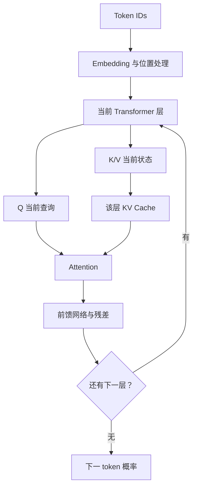
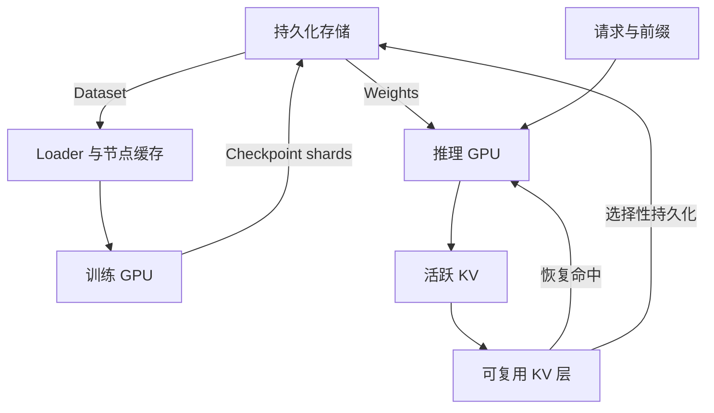
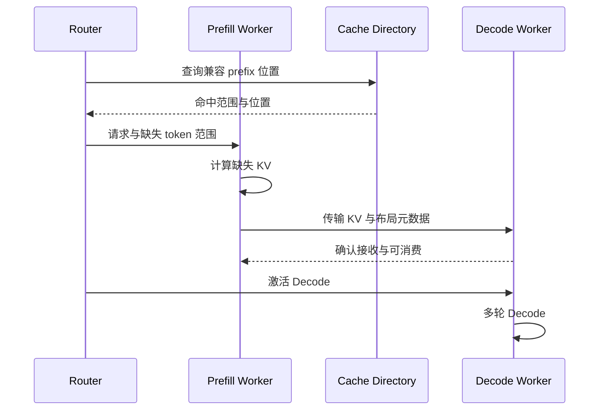
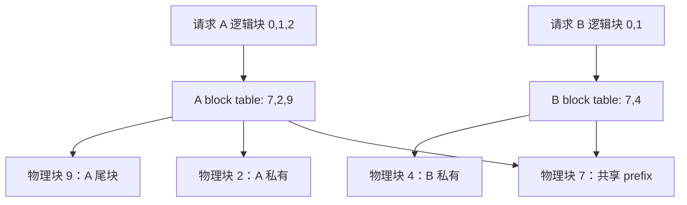
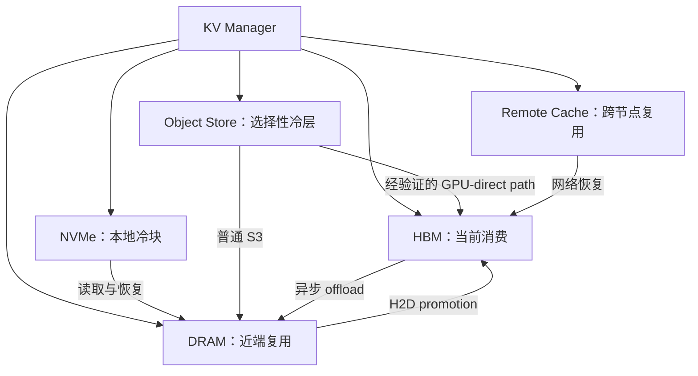

# AI Storage & KV Cache Interview Crash Course

> Document 1 · 主教程 · 面向有分布式对象存储经验的工程师  
> 核实日期：2026-09-19。正文以常规自回归、decoder-only、dense attention 的 Transformer 为基线；特殊模型明确标出。  
> 学习产出：能从 workload 推导容量、访问模式、缓存层级与存储选型，而不是只解释名词。

## 目录

- [0. 范围与使用方法](#chapter-0)
- [1. Storage Engineer 所需的 LLM 最小模型 — MUST KNOW](#chapter-1)
- [2. Training 与 Inference：两套不同的 Storage Workload — MUST KNOW](#chapter-2)
- [3. Prefill / Decode：一条请求的时间轴 — MUST KNOW](#chapter-3)
- [4. KV Cache 的容量、布局与生命周期 — MUST KNOW](#chapter-4)
- [5. PagedAttention 与 Prefix Caching — MUST KNOW](#chapter-5)
- [6. Offloading 与 Tiering：让“存得下”变成“用得上” — MUST KNOW](#chapter-6)
- [7. Object Storage 到底适不适合 KV Cache — MUST KNOW](#chapter-7)
- [8. 本月必须停在哪里](#chapter-8)

## 0. 范围与使用方法

这套教程默认你已经会设计对象存储的数据放置、复制、恢复和后台任务。需要补齐的是：**GPU 消费什么数据，以什么频率消费，哪些状态可以重算，哪些 I/O 会阻塞用户。**

| 等级 | 本文内容 | 面试达标标准 |
|---|---|---|
| MUST KNOW | Prefill / Decode、KV 原理与容量、MHA/GQA/MQA、分页、prefix reuse、offload 的边界 | 脱稿解释，完成算例，承受 2～3 层追问 |
| SHOULD KNOW | 数据加载、checkpoint、continuous batching、分离式推理、LMCache 的位置 | 能画路径，讨论成本和故障 |
| NICE TO KNOW | MLA、滑动窗口、混合注意力、KV 量化和非前缀复用 | 知道它们会改变哪些假设 |
| SKIP FOR NOW | 反向传播推导、优化器算法、Attention kernel 优化、框架全量源码 | 本月不投入 |

建议先读第 1～4 章，再读第 5～7 章。每章 Interview Check 先看答案，第二遍遮住答案口述。这里的“2 分钟回答”是组织答案的展开稿，语速不同可以适当压缩。

全文单位：`KB/MB/GB = 10³/10⁶/10⁹ bytes`；`KiB/MiB/GiB = 2¹⁰/2²⁰/2³⁰ bytes`。`Gbps` 是 bit/s，不是 byte/s。

## 1. Storage Engineer 所需的 LLM 最小模型 — MUST KNOW

### 1.1 从 token 到下一 token

**Token** 是 tokenizer 输出的整数 ID，可能代表一个词、词的一部分、标点或其他片段。一个中文字不保证对应一个 token。存储容量计算使用真实 token 数，不能直接用字符数替代。

**Embedding** 是从 token ID 查出的向量。它把离散符号变为数值表示；它既不是最终输出，也不是 KV Cache。相同 token 的初始 embedding 可以相同，但经过注意力层后，其表示取决于前文与位置。

一个最小的 decoder-only 模型可以理解为：token embedding 加上位置处理，依次进入多层 Transformer；每层包含 attention 和逐 token 的前馈网络，外加归一化与残差；最后输出下一 token 的概率分布。模型参数称为 **weights**，通常在一个服务版本内固定，跨请求共享。

图中的循环表示不同模型层，**每层都有独立参数和独立 KV**，不是重复使用同一层的缓存。

### 1.2 Q / K / V 到底是什么

对某层某个 token 的当前表示，模型通过不同的线性变换得到：

| 张量 | 直观用途 | 数据生命周期 |
|---|---|---|
| Q，Query | 当前 token 想从上下文中获取哪些信息 | 当前 attention 计算使用 |
| K，Key | 历史 token 可被当前查询匹配的特征 | 后续 token 还会读取 |
| V，Value | 匹配到该历史位置后要汇总的信息 | 后续 token 还会读取 |

只记住一个关系即可：**用当前 Q 与可见位置的 K 计算权重，再按这些权重汇总 V。** KV 里的 “Key/Value” 是注意力张量，不是 Redis 的字符串 key/value。

例如输入 token 序列 `[A, B, C]`。处理 C 时，这一层的 `Q_C` 读取 `K_A,K_B,K_C` 和对应的 V。下一步处理新 token D，使用的是 `Q_D`；它需要之前的 K/V，却不需要重新拿 `Q_C` 去计算 C 的输出。

### 1.3 为什么旧 K/V 可以缓存，旧 Q 通常不长期缓存

在因果注意力中，位置 i 只能看到自己和前面的 token。模型权重、位置规则与前缀不变时，后面追加 token 不会改变位置 i 原有的表示。因此已经算好的各层 K/V 可以继续使用。

新的 query 仍要与历史 K/V 做 attention，**缓存消除的是历史状态的重复计算，不是历史状态的读取**。对常规全注意力，单个新 token 的 attention 工作量仍随已有上下文长度增长。

旧 Q 已完成旧位置的查询；未来位置由自己的新 Q 发起查询，所以通常无需像 K/V 一样长期保存。训练反向传播或特殊算法可能保留其他中间量，那是另一种生命周期。[Transformers 官方缓存说明](https://huggingface.co/docs/transformers/main/cache_explanation)

**边界：**改掉前缀中第 100 个 token，通常会使第 100 个及其后续位置的 KV 失效；不能只替换这一块并继续复用后面的全部块。权重、LoRA、位置编码或输入图像变化也可能使 KV 失效。

### 1.4 MHA vs GQA vs MQA：关注 KV head 数

一个 attention head 是一组查询与匹配通道。下面固定 query heads 为 32：

| 结构 | Query heads | KV heads | 谁共享 K/V | 相对 KV payload |
|---|---:|---:|---|---:|
| MHA，Multi-Head Attention | 32 | 32 | 每个 Q head 使用自己的 K/V head | 1 |
| GQA，Grouped-Query Attention | 32 | 8 | 每组 4 个 Q heads 共享一个 KV head | 1/4 |
| MQA，Multi-Query Attention | 32 | 1 | 所有 Q heads 共享一个 KV head | 1/32 |

比较成立的前提是层数、head dimension、token 数和 KV datatype 相同。GQA/MQA 减少需要保留和搬运的 KV，不意味着整个模型权重按同样比例缩小，也不意味着可以给任何 MHA 模型随意改一个运行参数就得到等价 GQA 模型。它是模型结构/训练相关选择，存在质量和性能权衡。[GQA 原始论文](https://arxiv.org/abs/2305.13245)

**停止线：**会看配置中的 `num_hidden_layers`、`num_attention_heads`、`num_key_value_heads`、`head_dim` 即可，不推导 attention 的矩阵梯度。

### Interview Check

**30 秒回答 — Why does inference need KV Cache?**

> KV cache stores the keys and values already computed for previous tokens at each attention layer. During autoregressive decoding, the new query attends to those cached states, so the model avoids recomputing the entire prefix. The tradeoff is memory capacity and bandwidth that grow with context length and concurrency.

**2 分钟回答**

先限定常规自回归 Transformer。每一层对 token 生成 Q/K/V，当前 Q 通过历史 K 和 V 获取上下文。因果约束让后面追加的 token 不改变已有前缀状态，所以旧 K/V 可以保留。下一步只计算新 token 的各层状态，再读取旧 KV。旧 Q 不再承担未来位置的查询任务，所以通常不长期保存。缓存让计算更经济，但每个请求、每一层、每个 KV head 都会产生状态，长上下文和并发会占满 HBM。MHA/GQA/MQA 的重要差别是 KV head 数；减少它可以同时降低容量和搬运字节数。这个逻辑直接把模型结构连接到存储工程。

**Deep Dive**

1. **Q：能否把相同 token 的 KV 当成字典条目复用？** A：通常不行；KV 与它前面的上下文、位置、模型状态有关，不仅与 token ID 有关。
2. **Q：有 KV 后，Decode 的 attention 是常数复杂度吗？** A：不是。对全注意力，新 Q 仍扫描增长中的上下文；缓存避免重做历史 token 的网络计算。
3. **Q：GQA 如何降低存储成本？** A：减少 KV heads，降低每 token 的 KV bytes，进而降低 HBM 占用、offload 容量和搬运流量。实际内核读取次数仍受实现影响。

**Common Trap**

- “KV Cache 是模型权重缓存。”——它是输入相关的中间状态。
- “K/V 只由 token 本身决定。”——还取决于前缀和模型计算条件。
- “Q 完全没用，不必计算。”——每步都要计算新 Q，只是不长期缓存旧 Q。

## 2. Training 与 Inference：两套不同的 Storage Workload — MUST KNOW

### 2.1 训练为什么访问 Storage

训练至少涉及两条持久化路径：**读取训练样本，保存可恢复的训练状态。** GPU 内部还会产生大量临时状态与通信，但它们不全是对象存储流量。

| 数据 | 生命周期与共享 | 典型访问模式 | Storage Engineer 应关心什么 |
|---|---|---|---|
| Dataset | 长期、可重复使用 | shard 顺序读取中夹杂采样和 shuffle；原始格式可能是小文件随机读 | GET 数、read amplification、预取、节点缓存、数据预处理 |
| Model weights | 多个 step 更新 | GPU 内频繁读写；从持久化 checkpoint 初始化 | 加载带宽、分片、版本一致性 |
| Activations | 当前训练 step | 前向产生，反向使用 | 通常是 GPU/CPU memory 问题，不能等同 KV 服务缓存 |
| Gradients | 当前 step / 累积周期 | GPU 产生，跨 rank 归约 | 通信网络、拓扑、是否与存储争用 NIC |
| Optimizer state | 跨 step | 参与参数更新，随 checkpoint 保存 | checkpoint 可能远大于推理权重文件 |
| Checkpoint | 周期性持久化 | 突发大写；恢复时多节点同时读 | 原子发布、完整性、恢复耗时、后台带宽隔离 |

**DataLoader** 的任务是取样本、组 batch、做预处理并供给训练进程。若 GPU 等待样本，就算 FLOPS 很高也没用。但“GPU utilization 低”不等于一定缺对象存储吞吐：可能卡在解压、tokenization、Python worker、远端 metadata 或 Host→Device 拷贝。

一个量纲示例：8 个训练 worker，每个每步消费 256 MiB，step 时间 0.5 秒，理想供给至少 `8 × 256 / 0.5 = 4096 MiB/s = 4 GiB/s`。这是假设输入已是要读取的格式；压缩数据的后端带宽需求与解压后的 H2D 流量不同。

**避免小对象请求放大：**假设一个 batch 需要 256 MiB。若每条样本单独 GET 4 KiB，需要 65,536 次请求；若按 64 MiB shard 预取只需约 4 次大请求，但会牺牲随机访问精细度并可能多读。不是越大越好，而是让 shard 与 sampler、shuffle buffer、缓存容量相配合。

### 2.2 分布式训练只需掌握这一级

| 并行方式 | 主要变化 | 与 Storage 的连接 |
|---|---|---|
| Data parallel | 多 worker 处理不同样本，同步梯度 | dataset 划分和重复读取；checkpoint 避免重复保存同一份状态 |
| Tensor parallel | 一个层的张量跨 GPU 分片 | GPU 间通信频繁；checkpoint 需要记录分片布局 |
| Pipeline parallel | 不同层放在不同 GPU | stage 间传递 activation；加载和恢复要匹配层分配 |
| FSDP / optimizer sharding | 参数、梯度或 optimizer state 分片 | checkpoint 是多个 rank 的分布式快照，不能只写 rank 0 的局部状态 |

**All-reduce 流量是训练通信流量，不是读 dataset 的 S3 流量。** 两者可能争用同一网络，必须分别测量。

训练 checkpoint 大小没有统一常数。作为容量模型，若某混合精度方案每参数保存 FP16 权重 2 B、FP32 master weight 4 B、两个 FP32 optimizer 张量 8 B，总计 14 B/parameter，8B 参数约 112 GB。若还保存梯度则更大；有的实现不保存 master copy，有的格式保存额外状态。因此面试说清“保存哪些项”，不要背一个固定倍数。

一次 1 TB checkpoint，若要求 30 秒内完成持久化，**仅有效写吞吐就需 33.3 GB/s**，尚未计冗余、网络、序列化和尾部慢 rank。异步 checkpoint 可以先复制到 staging 再写存储，但 staging 本身消耗内存、PCIe 和 CPU；GPU 继续训练不代表 checkpoint 已耐久。

恢复必须拿到同一 step 的完整集合。实用方案是先写 immutable shards，确认完整性后发布 manifest/commit marker；不能看到部分 shards 就恢复。这部分可以直接复用你的分布式数据迁移和故障处理经验。

### 2.3 推理为什么访问 Storage

推理冷启动读取 model weights；稳态运行通常把 weights 留在 HBM。每个新请求产生 KV，后续持续消费。根据服务架构，KV 可保留在本机、外移复用，或从 Prefill worker 传给 Decode worker。

| 维度 | Training | Inference |
|---|---|---|
| 目标 | step/s、训练完成时间、恢复能力 | TTFT、ITL/TPOT、tokens/s、SLO 下吞吐 |
| 输入读取 | 持续 dataset 读取 | 启动时 weights；请求期可能读取 prefix KV |
| 持久化写 | 周期性大 checkpoint | 按复用价值选择写 KV；日志等另算 |
| Memory 随什么增长 | 参数、optimizer、activation、batch | 权重常驻；KV 随并发与上下文增长 |
| 对尾延迟敏感度 | 慢 rank 可拖慢同步 step | 一次 miss 或 Decode 阻塞可直接让用户卡顿 |
| 常见优化 | shard、预取、缓存、异步 checkpoint | prefix reuse、KV 分页、分层、调度与直达路径 |

### Interview Check

**30 秒回答 — How do training and inference differ for storage?**

> Training continuously reads datasets and periodically writes large, consistent checkpoints. Inference loads model weights and then creates request-specific KV state. Its storage decisions are driven by time to first token, inter-token latency, prefix reuse, and the cost of moving KV back to GPU memory.

**2 分钟回答**

我会先把持久化 I/O 与 GPU 通信分开。训练读取数据，Loader 做预处理和批处理，训练状态在 GPU 上更新，梯度同步走通信网络，周期性 checkpoint 再写存储。优化重点是 GPU 是否被持续喂饱、checkpoint 是否造成带宽突发、恢复是否拿到完整同版本状态。推理通常不在每个 token 都读模型文件；权重加载后常驻，变化的是每个请求的 KV。长上下文、并发和前缀复用决定它的容量与读写模式。于是存储指标从总吞吐扩展到 miss 恢复延迟、TTFT、Decode 停顿和搬运是否比重算便宜。两者都需要对象存储，但数据生命周期与关键路径完全不同。

**Deep Dive**

1. **Q：高吞吐对象存储就能让训练 GPU 满载？** A：未必；沿取样、读取、解压、预处理、H2D 分段测量，找到真正限制步骤。
2. **Q：异步 checkpoint 可以无限排队吗？** A：不能；staging 会挤占内存，存储写入跟不上会累积。设队列上限和 backpressure，必要时跳过非关键 checkpoint。
3. **Q：为什么 KV 不沿用 checkpoint 的强耐久策略？** A：权重和训练进度丢失昂贵；大部分 KV 可由权重和 token 重算。要按重算成本与服务连续性决定保护等级。

**Common Trap：**“AI Storage 就是训练数据读得快”；“梯度 all-reduce 等于 storage I/O”；“所有 checkpoint 都只包含权重”。

## 3. Prefill / Decode：一条请求的时间轴 — MUST KNOW

### 3.1 一次请求到底发生什么

假设 prompt 有 8,192 tokens，计划输出 256 tokens：

1. **Model loading**：进程启动时加载权重，分配运行时空间。暖服务的一次普通请求通常不重复这一步。
2. **Prefix lookup**：寻找已计算且兼容的前缀 KV。没有命中就从头算。
3. **Prefill**：在因果 mask 下并行处理 prompt 中尚未命中的 token，逐层产生 K/V，也得到第一个输出 token 的概率。
4. **Decode**：通常每个活跃序列每轮处理一个新 token；新 Q 读取已缓存 K/V，再追加自己的 K/V，生成后续 token。
5. **结束/暂停**：活跃引用释放；高价值完整块可留下复用，低价值状态丢弃或 offload。

严格区分“已经输出的 token”与“已经跑过前向、进入 KV 的 token”：Prefill 的最后输出可直接采样第一个生成 token，这个生成 token 的 KV 一般在下一轮前向时才产生。做宏观容量预算可以按 `prompt + max_new_tokens` 留余量，不必因一 token 的边界误差纠结。

### 3.2 三个服务指标

| 指标 | 定义 | 被什么拖慢 |
|---|---|---|
| TTFT，Time To First Token | 请求进入服务到首 token 返回 | 排队、prefix lookup/load、未命中 Prefill、必要通信 |
| ITL，Inter-Token Latency | 相邻输出 token 的间隔 | Decode 调度、HBM/计算、通信、活跃 KV 等待 |
| TPOT，Time Per Output Token | 常见定义为首 token 后平均每个输出 token 耗时 | 是平均值，不能代替逐 token 尾延迟 |
| Throughput | 单位时间服务的请求或 token 数 | batching、容量、计算和传输瓶颈 |

必须说明计时范围与指标定义；不同 benchmark 对排队、首 token、输入 token 的计数可能不同。

### 3.3 为什么 Prefill 常偏计算，Decode 常偏带宽

Prefill 同时有许多输入 token，可以用较大矩阵运算；全注意力还要处理 token 间关系。Decode 每个序列通常只有一个新 query，但仍要访问权重和不断增长的历史 KV，小 batch 时计算复用有限，因此常受 memory bandwidth 限制。

这是**常见工作区间，不是物理定律**：大 batch、长上下文、模型结构、并行通信和 kernel 实现都会改变瓶颈。面试最好说“我会用实际 profiler 和字节/算力模型验证”。

**Continuous batching**：每轮把仍在运行的请求组成 batch，已完成的退出，新请求加入。它提高 GPU 利用率，但引入可变长度、动态 KV 分配和调度公平性问题。Batch 变大可能改善吞吐，也可能恶化 TTFT/ITL。

**Chunked prefill — SHOULD KNOW**：把长 prompt 的 Prefill 切成多轮 token budget，与 Decode 交错，减少长输入独占 GPU。它改变调度粒度，不自动消除 KV 容量需求，也不是把 prompt 切块后可以无视前后依赖地独立计算。

### 3.4 分离式推理 — SHOULD KNOW

Prefill worker 和 Decode worker 分开部署，可以分别按各自瓶颈扩容和调度，但必须把 prompt KV 交接过去。

如果 1 GiB KV 必须在交接前全部传完，那么即使理想 400 Gbps 单链路也要约 21.5 ms；这不是一个可以忽略的函数调用。分离是否值得，要同时看 GPU 效率收益、网络成本和 TTFT 增量。

### Interview Check

**30 秒回答 — Prefill vs Decode?**

> Prefill processes the prompt and builds its KV cache, often using large parallel matrix operations. Decode repeatedly processes new tokens while reading the existing KV cache. Prefill mainly affects time to first token; Decode determines inter-token latency. Their resource balance differs, so scheduling and storage policies should distinguish them.

**2 分钟回答**

对一个长 prompt，Prefill 处理尚未命中的输入位置，在每层建立 K/V，并得到首个输出的分布。之后 Decode 逐步处理新生成的 token，读取历史 KV 并追加新的状态。Prefill token 并行度更高，通常计算密集；Decode 小 batch 下往往受权重和 KV 读取带宽限制。前缀缓存减少的是重复 Prefill，通常主要改善 TTFT，不会免掉每步 Decode 对前缀 KV 的读取。调度上可以使用 continuous batching 和 chunked prefill，在吞吐和尾延迟之间取舍。若把两阶段放在不同 worker，要把 KV 传输计入首 token 或交接路径的预算，并保证目标 worker 的模型、分片和布局兼容。

**Deep Dive**

1. **Q：Prefix cache hit 为什么 Decode 仍可能很慢？** A：命中省去重新构建 KV，但长历史在后续步骤仍参与 attention。
2. **Q：分离后用对象存储传一次 KV 行不行？** A：可以作为架构选项，但交接延迟常需要直接 GPU/DRAM 网络传输；对象存储必须通过实际 SLO 和吞吐测算。
3. **Q：能一边传 KV 一边 Decode 吗？** A：可按层/块建立流水依赖，前提是相应层消费前数据完整可见，且流水缓冲、同步与错误处理正确；不能假设自动重叠。

**Common Trap：**“Prefill 完成后就不读取 prefix”；“所有 Decode 都完全 memory-bound”；“分离推理只有收益、没有 KV 交接成本”。

## 4. KV Cache 的容量、布局与生命周期 — MUST KNOW

### 4.1 公式要从维度推出来

对层形状一致的常规 MHA/GQA/MQA 模型，一个序列的理想 KV payload：

`KV_bytes = 2 × L × Hkv × D × T × s`

| 符号 | 含义 | 为什么出现 |
|---|---|---|
| 2 | K 和 V 两份 | 通常具有相同元素数与 datatype |
| L | num_layers | 每一层缓存独立 K/V |
| Hkv | num_kv_heads | 不要误用 query heads |
| D | head_dim | 每个 head 的向量长度 |
| T | 已缓存 token count | 通常含 prompt 与已处理的生成 token |
| s | 每元素字节数 | FP16/BF16 为 2，常见 FP8 payload 为 1 |

不同层形状不一时，对每层分别求和。不同请求长度不一时，对请求求和。这里先计算逻辑 payload；padding、block 浪费、allocator 元数据、量化 scale、复制和分片布局另加。

### 4.2 贯穿三份教程的假设模型

这不是某个真实产品配置，而是**便于面试心算的假设 GQA 模型**：

| 参数 | 值 |
|---|---:|
| Layers | 32 |
| Query heads | 32 |
| KV heads | 8 |
| Head dimension | 128 |
| Cached tokens / request | 8,192 |
| KV dtype | FP16 / BF16 |

每 token：`2 × 32 × 8 × 128 × 2 = 131,072 B = 128 KiB`。

每请求：`128 KiB × 8,192 = 1 GiB`。

| 已缓存 token 数 | 1 请求 FP16 | 10 请求 FP16 | 100 请求 FP16 | 1 请求 FP8 payload |
|---|---:|---:|---:|---:|
| 2,048 | 256 MiB | 2.5 GiB | 25 GiB | 128 MiB |
| 8,192 | 1 GiB | 10 GiB | 100 GiB | 512 MiB |
| 32,768 | 4 GiB | 40 GiB | 400 GiB | 2 GiB |

表中假设**无共享、无分片、无额外开销**。FP8 不只是把文件每两个 byte 丢掉一个：需要合适量化和 scale，并验证模型、attention backend、GPU 和数值质量。

### 4.3 同一模型尺寸下，换 KV head 数

保持其余参数与 8,192 tokens、FP16 不变：

| Attention | KV heads | 每 token | 每请求 | 100 请求 |
|---|---:|---:|---:|---:|
| MHA | 32 | 512 KiB | 4 GiB | 400 GiB |
| GQA | 8 | 128 KiB | 1 GiB | 100 GiB |
| MQA | 1 | 16 KiB | 128 MiB | 12.5 GiB |

这张表解释了为什么面试官会从模型配置追问到存储架构：同样叫“8K 上下文”，KV 需求可能差一个数量级。

### 4.4 HBM 容量不是全给 KV

`HBM_budget = weights + KV + activations/workspace + graphs/runtime + safety_margin`

不要直接把显卡铭牌容量除以每请求 KV。作为假设预算：进程实际可用 80 GiB，权重占 15 GiB，其他空间与余量 9 GiB，剩余 KV budget 为 56 GiB。每请求 1 GiB，则 payload 上限约 56 个，而不是 80 个。若上下文继续增长到 32K，就下降到约 14 个。**80 GiB 是本例预算输入，不等同某型号标称 80 GB。**

Weights 与 KV 的量化独立：权重 INT4 不代表 KV 也 INT4。需要分别确认。

**Tensor parallel 追问：**若 8 个 KV heads 被 4 张卡均匀分片，每卡可约承担 1/4 KV；但当 KV heads 少于并行度，某些实现会复制 KV heads，不能机械地除以 GPU 数。Pipeline parallel 按层分配又是另一种切分。先问布局再算容量。

### 4.5 共享 prefix 的真实容量收益

沿用 GQA 示例：10 个请求，每个 8,192 tokens，其中前 4,096 tokens 完全相同且可共享。

- 不共享：`10 × 1 GiB = 10 GiB`。
- 同一 GPU 上共享前缀物理块：公共 `0.5 GiB` 一份，加 `10 × 0.5 GiB` 私有后缀，总计 `5.5 GiB`。
- 若把每请求从远端各拉一份到独立 buffer，只是避免重算，并没有实现 HBM 内物理共享。
- 跨 GPU/节点共享持久化对象，不等于所有 GPU 共享同一个 HBM 地址；每张 GPU 可能仍要持有自己的消费副本。

### 4.6 KV layout：逻辑上连续，不代表物理上连续

可以把每层的 K、V 分别想成 `[request, kv_head, token, head_dim]` 张量。真实布局可能重排维度、按页分配、拆分 K/V、跨层聚合或跨 rank 分片，以满足 attention kernel 和传输效率。

必须区分三个大小：

| 粒度 | 示例 | 服务于什么 |
|---|---|---|
| Kernel/allocator 的 KV page | 16 tokens；本例全层 payload 共 2 MiB | 分配与 attention 寻址 |
| Transfer chunk | 512 tokens；本例全层共 64 MiB | 合并 I/O、降低每次提交开销 |
| Object/package | 一个或多个 transfer chunks | 命名、索引、持久化、GC |

本例一个 16-token page **单层** K+V 是 `2 × 8 × 128 × 16 × 2 = 64 KiB`，32 层合计 2 MiB。这个合计可以由 32 个分散区域组成，甚至 K/V 各自分开。把它叫作“2 MiB block”并不能证明能发一次连续 DMA。

选择层优先便于 layerwise prefetch；选择跨层聚合便于大 I/O。要么做 gather/scatter，要么保存多段 descriptor，要么转换成传输布局。转换也占 CPU/GPU 带宽，不能漏算。

### 4.7 Lifetime：哪些块能驱逐

| 状态 | 内容可变吗 | 能立即回收吗 |
|---|---|---|
| 新请求正在填充的尾块 | 可能继续追加 | 不行，存在 producer |
| 活跃 Decode 读取的历史块 | 通常不可变 | 不行，有 consumer 引用 |
| 已完成且无人使用的完整 prefix 块 | 不可变 | 可以按策略淘汰或降层 |
| 正在 offload 的块 | 应固定内容 | 传输完成前不能复用源 buffer |
| 正在恢复的目标块 | 部分有效 | 不能发布给 attention kernel |

完成请求只意味着逻辑使用结束，不代表所有异步 DMA 已结束。**引用计数、传输 lease 和 completion 共同决定实际 lifetime。** 这是你后面读 C++/CUDA/RDMA 时最重要的连接点。

### Interview Check

**30 秒回答 — How do you calculate KV Cache size?**

> For a uniform decoder model, payload bytes are two times layers, KV heads, head dimension, cached tokens, and bytes per element. The factor two is for K and V. Then I account for concurrent sequences, prefix sharing, tensor-parallel placement, block padding, and runtime overhead separately.

**2 分钟回答**

我先声明模型与单位。对于 32 层、8 个 KV heads、head dimension 128、FP16 的模型，每 token 是两份 K/V 乘各维度，总计 128 KiB；8,192 tokens 是 1 GiB，一个请求就是这个量级，100 个不共享请求需 100 GiB。若是 32 个 KV heads 的 MHA，就变成四倍；FP8 的原始 payload 大约减半，但有 scale 和质量约束。然后从 GPU 可用 HBM 扣除权重、工作区和余量，再评估能容纳多少请求。最后检查前缀是否物理共享、KV 是如何跨卡分片的，以及逻辑 block 是否对应一块连续内存，避免把理想容量误报成真实使用量。

**Deep Dive**

1. **Q：为什么用 KV heads，不用 attention heads？** A：GQA/MQA 中多个 query heads 共享 KV；被缓存的是实际 KV heads。
2. **Q：100 个 8K 请求一定占 100 GiB 吗？** A：这是未共享、未分片的 payload；实际还看长度分布、prefix 共享、量化与 allocator。
3. **Q：一个请求传完 1 GiB，就能直接复用吗？** A：还需模型和上下文一致、目标布局兼容、所有分片齐全、校验通过、设备可见，并安装 block table。

**Common Trap：**漏掉 K/V 的系数 2；混淆 GB 与 GiB；把 query heads 当 KV heads；忽略 weights；以为 FP16 权重决定 KV dtype；按 GPU 数无条件均分。

## 5. PagedAttention 与 Prefix Caching — MUST KNOW

### 5.1 连续大 buffer 为什么浪费

如果每请求都按最大 32K tokens 分配连续空间，而多数请求只用 2K，预留会浪费。若按增长重分配，则可能搬运已有 KV。不同长度请求结束、增长交错，还会留下难以利用的空洞。

分页思路把序列切成固定 token 数的逻辑块，映射到可不连续的物理块。attention kernel 借助 block table 找到正确位置。无需给每个请求预留一大片最大长度空间。

上图是**教学示例**。逻辑块号不等于物理地址；两个 block table 指向同一个完整、兼容且只读的 prefix 块，可以节省容量。共享可写尾块时需要 copy-on-write 或保持私有，否则一个请求追加会破坏另一个请求。

以 16 tokens/page 为例，65 tokens 需要 5 页，容量 80 tokens，末页浪费 15 tokens。尾部内部浪费小于一页；但实际系统仍可能存在不同池、分组、预留和运行时开销。**分页降低碎片和预留浪费，并不让每 token 的 KV payload 变小。**

### 5.2 PagedAttention 到底解决什么

| 能解决/改善 | 不能自动解决 |
|---|---|
| 非连续物理块的寻址 | HBM 本身的容量上限 |
| 动态增长和回收 | 权重内存占用 |
| 共享 prefix 的块级引用 | NVMe/Object Storage 自动换页 |
| 可变长度请求的分配效率 | 模型跨版本兼容 |
| 减少部分碎片与预留 | 所有 attention backend 的相同物理布局 |

**版本边界：**vLLM 当前官方 Paged Attention 设计页明确标为 historical，不再描述今天完整代码路径。本文学习的是分页式 KV 管理的原理，不把旧 kernel 文件、张量布局或默认 block size 当作所有当前配置的事实。[vLLM Paged Attention 页面](https://docs.vllm.ai/en/latest/design/paged_attention/)

### 5.3 Prefix caching：计算复用，不是答案复用

请求 A 的 token 前缀是 `[system, document, question_A]`，请求 B 是 `[system, document, question_B]`。如果 system 和 document 的 token、位置及模型状态一致，则这段计算结果可能复用；答案仍重新生成。

一个可以解释的教学 key 链：

`h_i = Hash(h_(i-1), tokens_in_block_i, model_namespace, extra_input_identity)`

前块 hash 使后块绑定到完整历史，而不只是绑定当前块的局部 token。真正的跨进程格式还需要确定性序列化和版本标识，Document 3 会展开。

vLLM 当前 prefix caching 设计使用前块 hash、当前 token 和额外身份信息；文档描述完整块缓存与 cache salt 隔离。不能把“同一段文字出现在任意位置”当成无条件命中。[vLLM Automatic Prefix Caching](https://docs.vllm.ai/en/latest/design/prefix_caching/)

教学例：block size=4，A 前缀 `ABCDEFGH`，B 前缀 `ABCDEFXY`。首块 `ABCD` 可共享，第二块不同。即使 B 第三块恰好与 A 第三块 token 相同，前置上下文已变化，仍不能直接共享。

### 5.4 策略和数据结构只学到哪里

你需要解释以下结构的职责，不必背 vLLM 当前类名：

- Free block pool：可重新分配的物理块。
- Request block table：一个序列的逻辑位置到物理块映射。
- Prefix index：兼容内容身份到缓存块的映射。
- Refcount / pin count：谁还在使用、谁正在搬运。
- Eviction order：从无人使用且可重算的块中选牺牲者。

**三层追问的关键：**内容命中、位置存在、当前可消费，是三个不同判断。索引里有 key 但对象已淘汰，不是有效命中；在 CPU 有副本，也不代表 GPU 可以立即执行。

### Interview Check

**30 秒回答 — What does PagedAttention solve?**

> PagedAttention lets attention consume KV stored in fixed-size, noncontiguous memory blocks through a block table. This reduces large contiguous allocations and reservation waste, and enables block sharing. It is a memory-management and access technique; it does not automatically turn remote storage into GPU memory.

**2 分钟回答**

变长请求如果各自持有连续最大长度 buffer，会浪费空间；如果不断扩容，又可能搬运已有状态。分页把序列分成固定 token 粒度的逻辑块，用 block table 映射到物理页，kernel 按映射读取。请求增长时再分配页面，结束后按引用计数回收。相同完整 prefix 可由多个请求指向相同块，因此 prefix caching 既可能节省 Prefill 计算，也可能节省 HBM 物理副本。代价是寻址、元数据和末页内部碎片。这里的“paging”不是 OS 磁盘缺页；跨 CPU、NVMe、对象存储的搬运仍需缓存管理器和调度器。实际 vLLM 布局还要按版本与 attention backend 判断。

**Deep Dive**

1. **Q：为什么不能简单按当前块 token hash？** A：同样 token 在不同前文下得到的 KV 不同，所以需要整个前缀身份。
2. **Q：两个请求共用尾块后继续生成怎么办？** A：保持尾块私有或写时复制；已有完整块不可变共享，引用到零且传输结束才回收。
3. **Q：把 block 调大可以更快吗？** A：可能减少元数据和传输次数，但增加末页浪费、读放大和匹配粒度损失。计算 page 和 storage chunk 可分别设计。

**Common Trap：**PagedAttention 等于 FlashAttention；paged KV 等于自动 CPU/disk swap；Prefix caching 等于缓存整个回答。FlashAttention 主要优化 attention 计算的 I/O 与中间结果，和分页管理是不同维度，可组合。

## 6. Offloading 与 Tiering：让“存得下”变成“用得上” — MUST KNOW

### 6.1 先分开三种动机

| 动机 | 什么时候搬 | 主要收益 | 主要风险 |
|---|---|---|---|
| 保存可复用 prefix | 请求完成后或计算过程中异步保留完整块 | 后续请求省 Prefill | 没人再用，白写一遍 |
| 暂停/抢占请求 | 活跃请求暂时不调度 | 释放 HBM 给更有价值的工作 | 恢复时出现 TTFT/ITL 尖峰 |
| 活跃计算的容量扩展 | 每层或每步把所需 KV 搬回 | 执行本来放不下的上下文 | 重复流量和同步让 Decode 极慢 |

同样叫 offload，三者不能混谈。**“某框架支持 KV offload”并不自动意味着它能高效地在每个 Decode step 从对象存储读取所有 KV。**

### 6.2 从 HBM 到 Object Storage 的层级

下表的性能范围用于建立数量级，**是容量规划假设，不是产品 SLA 或硬件实测**。延迟行区分内存访问、I/O 请求开销；大 payload 的总耗时还需加 `size/bandwidth`。具体有来源的硬件数字见 Document 2。

| Tier | 大致访问/传输特征 | 容量与单位成本 | 持久性/共享 | 常见失败 |
|---|---|---|---|---|
| GPU HBM | 本地内存访问约百 ns～µs 量级；聚合带宽 TB/s 级 | 紧缺、昂贵 | 易失；同卡可共享物理块 | GPU reset、进程错误、OOM |
| CPU DRAM | 本地 load 约百 ns；但搬到 GPU 受 PCIe 等限制，提交为 µs 级 | 较大、较便宜 | 易失；同节点共享较易 | 节点故障、NUMA 远端访问 |
| Pinned DRAM pool | 仍是 CPU DRAM，只是满足 DMA/异步生命周期要求 | 不应把全部 DRAM 都 pin 住 | 不是额外持久化 tier | pin 配额、压力、注册资源不足 |
| Local NVMe | 小 I/O 常按几十～数百 µs 建模，排队可更大；单盘数 GB/s 级 | TB 级较经济 | 介质持久；节点坏了可能暂时不可达 | SSD 故障、写放大、容量耗尽 |
| Remote DRAM cache | 网络与软件路径常按数 µs～数百 µs 建模 | 可池化 | 共享方便；默认易失 | 网络、远端进程、热点 |
| Remote NVMe / Storage | 后端介质+网络+队列，几十 µs 到 ms 或更高 | 可扩展 | 持久化取决于协议与提交语义 | 远端存储、拥塞、重建干扰 |
| Object Storage | 不能给单一延迟；常规部署可按 ms～几十 ms 起做假设，优化本地实现可能更低 | 大容量、较低单位成本 | 对象级持久化与共享 | API 超时、长尾、不可达、配额 |

**Pinned memory 是内存属性，不是比 DRAM 更快的一种存储介质。Remote cache 与 Object Storage 也不是同义词。**

### 6.3 不必每次经过所有层

层级描述的是保留策略与成本。一次 miss 可以从对象存储直达 GPU，也可以经过 pinned DRAM；不必先完整写入 NVMe 再完整写入 CPU 再完整写入 GPU。

### 6.4 一次恢复是否值得：必须和重算比较

定义：

`T_restore = lookup + queue + storage_read + transfer + layout_conversion + visibility_sync`

在流水系统中部分项可重叠，不一定全部相加。用于保守预算时先相加；用 trace 证实重叠后再扣减。

若一个已有 prefix 的 KV 为 1 GiB，假设有效读带宽 8 GiB/s，固定开销 3 ms，转换与同步 5 ms：

`T_restore ≈ 125 + 3 + 5 = 133 ms`。

- 同一负载下重新 Prefill 为 400 ms：恢复有机会节约 267 ms。
- 重新 Prefill 为 60 ms：恢复可能更慢。
- 若恢复能利用排队等待时间，而重算占用稀缺 GPU，系统吞吐结论又可能不同。

所有数字都是教学输入，不是某 GPU/对象存储 benchmark。**存储命中率高，也可能比不使用外层缓存更慢。**

对是否写冷层，可以用简化净收益：

`expected_benefit ≈ expected_reuses × (T_recompute − T_restore) − offload_cost − contention_cost`

时间只是统一成本的一种近似，不能直接把后台毫秒与关键路径毫秒等价相减；生产中可换成 GPU 时间、带宽成本和 SLO 违约代价。这个公式的价值是提醒你：不复用、恢复慢或竞争大时，就别缓存。

### 6.5 为什么活跃 Decode 全量 offload 很危险

沿用每请求 1 GiB KV。假设 10 个请求都需要每步从远端搬回 1 GiB，目标每请求每秒 50 tokens：

`10 × 1 GiB × 50 = 500 GiB/s`。

单条 400 Gbps 理想也只有 50 GB/s，约 46.6 GiB/s；尚未考虑计算与协议，已相差约 10.7 倍。分层保存冷 prefix 是合理设计空间，把远端当透明 HBM 扩容则必须有窗口化、稀疏读取、按层流水或其他模型/系统支持。

LRU 不能随意丢弃活跃请求仍需要的 KV。若淘汰后无法在使用前恢复，就要暂停或重新 Prefill；静默截断全注意力的历史会改变输出语义。

### 6.6 Prefetch、promotion、demotion

| 操作 | 触发点 | 必须控制的成本 |
|---|---|---|
| Prefetch | 请求已经排队且 prefix 命中；或已知下一层/下一块将消费 | 错误预测占网络、内存、HBM；取消后仍可能有在途 DMA |
| Promotion | 某块即将被消费，提升到更近 tier | 容量 reservation、复制结束与可见性 |
| Demotion | HBM 压力、高价值块暂时不活跃 | 源 buffer 不能提前释放；低 tier 写入是否有净收益 |
| Eviction | 无活跃引用且保留价值低 | 删除索引与内容的次序、并发 lookup 的 lease |

Prefetch 的关键不是“尽量早”，而是 `预计可用时间 ≤ 消费 deadline`，且不挤掉更有价值的热数据。已知排队请求比猜测未来用户输入更容易预测。

### 6.7 vLLM 与 LMCache 放在哪里 — SHOULD KNOW

vLLM 是推理执行/调度框架，内部管理 GPU KV。它也有 KV connector/offloading 机制。官方 2026-01 的文章解释原生 CPU offloading 与为传输优化物理布局的工作；文章中的版本与性能结果仅对其发布时配置成立。[vLLM Offloading Connector](https://vllm.ai/blog/2026-01-08-kv-offloading-connector)

LMCache 是外部 KV 管理与复用层，可把 KV 放到 CPU、磁盘或远端后端。当前官方文档还区分独立进程模式与 legacy in-process 模式，不能把以前某个单进程示例视为全部现状。[LMCache 官方概览](https://docs.lmcache.ai/)

**概念连接：**`Inference engine ↔ KV connector ↔ KV 管理层 ↔ storage/transport backend`。这条分工不保证任意版本可以互换；runtime ABI、模型/layout、connector、后端和 GPU 支持要组合验证。[LMCache 兼容性说明](https://docs.lmcache.ai/getting_started/compatibility.html)

### Interview Check

**30 秒回答 — Why offload KV Cache?**

> Offloading can free scarce HBM and preserve reusable prefixes in cheaper tiers. It helps only when the saved recomputation or additional serving capacity outweighs transfer, conversion, and contention costs. I distinguish cold-prefix reuse from repeatedly fetching active Decode state, because their bandwidth requirements are very different.

**2 分钟回答**

HBM 既贵又有限，但不是所有 KV 都同样热。我优先保留活跃 Decode 工作集，把暂时不用且有复用价值的完整 prefix 放入 CPU、NVMe 或远端，低价值的直接丢掉，因为它可以重算。恢复策略比较整个 load-to-ready 时间与 Prefill 重算时间，还要满足 TTFT 和 ITL。对象存储容量大、便于共享，适合经过筛选的长寿命冷 prefix，但延迟、对象粒度、读放大和转换可能抵消收益。活跃 Decode 如果每步回读全部历史，带宽需求会乘上请求数与 token 速率，可能比网络高一个数量级。因此分层是结合调度、热度、deadline 和路径能力的策略，不是把 HBM 地址空间无限延伸出去。

**Deep Dive**

1. **Q：为什么远端命中还可能选择重算？** A：查目录、排队、读取、传输和布局转换之和，可能比 GPU 重算更慢。
2. **Q：Prefetch 失败会损失什么？** A：浪费网络与 I/O，占目标空间，可能驱逐热块；取消不一定停止已经提交的 DMA。
3. **Q：Offload 后立即复用 HBM buffer 行不行？** A：不行。要等传输消费完源数据；必须由 completion 与 lease 管生命周期。

**Common Trap：**“越多层越好”；“pinned memory 是独立于 DRAM 的缓存层”；“远端命中等于 GPU ready”；“Offload 必然提升延迟”。

## 7. Object Storage 到底适不适合 KV Cache — MUST KNOW

### 7.1 先回答三个问题

1. **保存什么？** 活跃窗口、暂停请求、历史 prefix，还是 Prefill→Decode 交接？
2. **为什么不重算？** 有可测量的计算代价与复用概率吗？
3. **怎样进入 GPU？** S3/TCP 到 pinned DRAM，还是经过验证的 RDMA/GPU-direct 路径？

| 情景 | 判断 | 工程原因 |
|---|---|---|
| 低延迟 Decode 每步读取小 KV 页面 | 通常不选传统 Object Storage | 请求开销、长尾和串行依赖会进入 token 关键路径 |
| 高复用、很长的企业公共 prefix | 值得评估 | 重算昂贵，可聚合大块并在排队时预取 |
| 低复用的一次性短问题 | 通常不保存到对象层 | 写入、索引、恢复可能比重算更贵 |
| 跨 worker 共享冷 prefix | 有条件适合 | 统一命名与容量有优势，但仍需兼容格式和就近恢复 |
| Prefill/Decode 同机房高速交接 | 优先比较直接网络传输 | 持久化对象层可能增加额外提交和读取开销 |
| 很低频但必须继续的会话 | 取决于恢复 SLO | tokens 重新 Prefill 可能比保留海量 KV 更经济 |

### 7.2 Object Storage 的价值不止“磁盘便宜”

你已有的能力可以直接落到这里：namespace 与 tenant 隔离、immutable blob、版本管理、索引、校验、分片、placement、故障恢复、容量回收、流控、监控。

但 KV 的新约束是：**内容能读出来还不够，必须在消费 deadline 前按正确 tensor layout 到达 GPU。** 一个吞吐很高、但 p99 抖动严重的对象层，可能适合 checkpoint，却不适合活跃 KV。

若把许多 page 聚合到一个 object：减少请求数，利于带宽；代价是小命中可能多读，局部过期难单独回收，Range GET 还可能在后端触发更大 EC stripe 的读取。客户端只收 2 MiB 并不证明后端只读 2 MiB。

### 7.3 最小的正确架构判断

冷层对象应尽量 immutable，以模型/格式 namespace 隔离；热门 prefix 缓存在近端；lookup 返回位置与兼容性而不是长期 GPU 地址；恢复前预留 GPU 容量；完成、校验和设备可见后发布；远端失败允许走重算或其他副本，禁止把半块交给 attention。

“是否适合”应通过真实 prefix 长度、热度分布与 end-to-end SLO 决定。Document 3 会把这些约束展开为一套可面试的设计。

### Interview Check

**30 秒回答 — Is Object Storage suitable for KV Cache?**

> It can be a cold, shared tier for valuable reusable prefixes, but it is usually a poor default for fine-grained active Decode reads. I compare restore-to-GPU latency with recomputation, then consider object granularity, reuse probability, prefetch opportunities, layout compatibility, and failure behavior.

**2 分钟回答**

我不会先给绝对结论。先区分是保存冷 prefix 还是服务每 token 的活跃读取。对象层的优势是容量、成本、统一命名、共享和已有数据保护机制；劣势是请求开销、尾延迟、对象粒度，以及从存储格式恢复到 GPU 布局的成本。对于长且高复用的公共 prefix，如果恢复比重算快，且能利用请求排队时间预取，它可能很有价值。对于短、低复用或者必须每步读取的小块，通常近端 HBM/DRAM 更合适。即使对象层有 RDMA 直达 GPU，也只改善数据路径，不消除后端介质延迟、EC 放大和缓存策略问题。我会用实际 workload 的 TTFT、ITL 与 GPU 时间节省判断收益。

**Deep Dive**

1. **Q：为什么不把所有 KV 都持久化？** A：多数 KV 未必复用；写放大、空间、过期回收和模型换版会吞掉收益。
2. **Q：已有 S3 能直接做透明 HBM 扩容吗？** A：不能；需要引擎连接、块索引、恢复调度、layout conversion、同步和错误回退。
3. **Q：对象层强持久化能保证会话恢复吗？** A：KV 只是部分状态；还需要 token 历史、模型身份、采样/RNG 等状态。GPU 故障后恢复服务不等于逐 bit 无缝续算。

**Common Trap：**“Object Storage 永远太慢”；“用了 RDMA 就总是适合”；“KV 耐久了，整个推理会话就完整耐久了”。

## 8. 本月必须停在哪里

| 扩展概念 | 本月等级 | 只需记住 |
|---|---|---|
| Sliding-window attention | NICE TO KNOW | 某些层只保留窗口内状态，不能对全注意力模型随意删历史 |
| MLA / latent KV | NICE TO KNOW | 缓存压缩后的 latent 状态，不能直接套常规 GQA 公式 |
| Hybrid/recurrent models | NICE TO KNOW | 不同层状态不同，按层计算并核对后端支持 |
| KV quantization | SHOULD KNOW | 减少 bytes，但有 scale、精度、kernel 和格式兼容约束 |
| 任意位置 KV 重用 / CacheBlend | NICE TO KNOW | 通常涉及选择性重算或质量策略，不等同 exact prefix caching |
| KV 压缩算法细节 | SKIP FOR NOW | 本月只会比较压缩耗时、压缩比与传输节约 |
| Attention 数学、CUDA kernel 推导 | SKIP FOR NOW | 不影响本月 system design 的核心判断 |

**闭卷验收：**给你一个 `L/Hkv/D/T/dtype` 配置，五分钟内算出单请求和 100 并发容量，解释为什么 prefix hit 不消除 Decode 读带宽，再给出对象层应该缓存和不应该缓存的各一个场景。如果能讲清楚，继续 Document 2，不必再扩大学习面。

## 官方资料定位

这些链接用于核对技术边界，正文已经包含本月所需解释，无需通读所有文档。

| 资料 | 本文核对的事实 |
|---|---|
| [Transformers cache explanation](https://huggingface.co/docs/transformers/main/cache_explanation) | 因果推理中的缓存与按层状态 |
| [GQA 原始论文](https://arxiv.org/abs/2305.13245) | GQA/MQA 的 head 共享关系 |
| [vLLM Paged Attention](https://docs.vllm.ai/en/latest/design/paged_attention/) | 该说明页当前标为历史设计 |
| [vLLM Prefix Caching](https://docs.vllm.ai/en/latest/design/prefix_caching/) | hash 链、完整块与隔离 |
| [vLLM Offloading Connector，2026-01-08](https://vllm.ai/blog/2026-01-08-kv-offloading-connector) | 原生 offload 的动机与物理布局影响 |
| [LMCache](https://docs.lmcache.ai/) | 外层 KV 管理与后端定位 |
| [LMCache compatibility](https://docs.lmcache.ai/getting_started/compatibility.html) | 版本、ABI、模型及 connector 需组合验证 |
