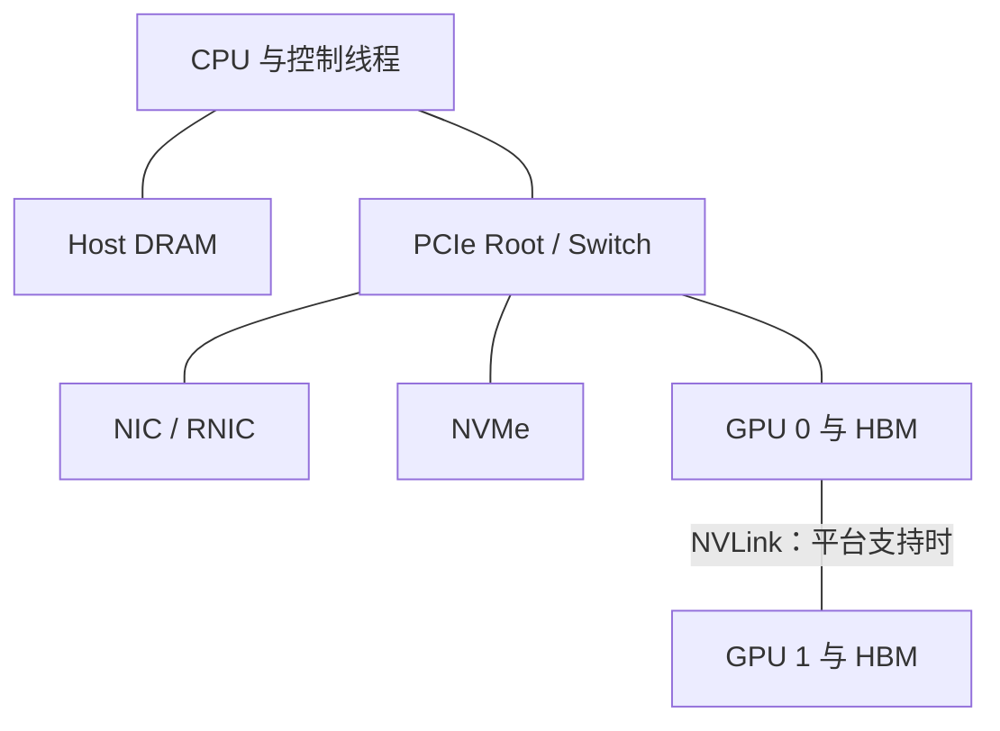
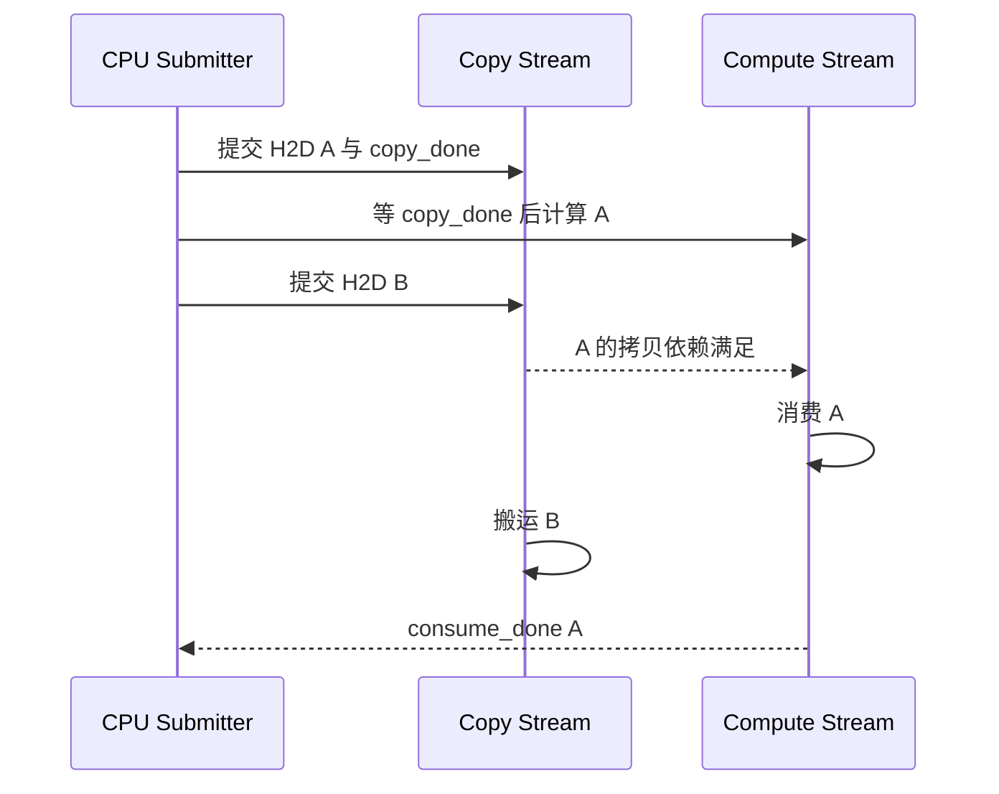
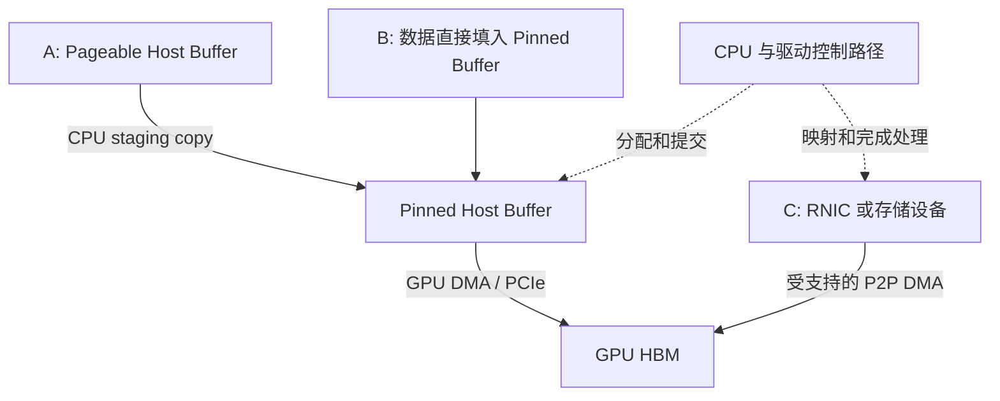
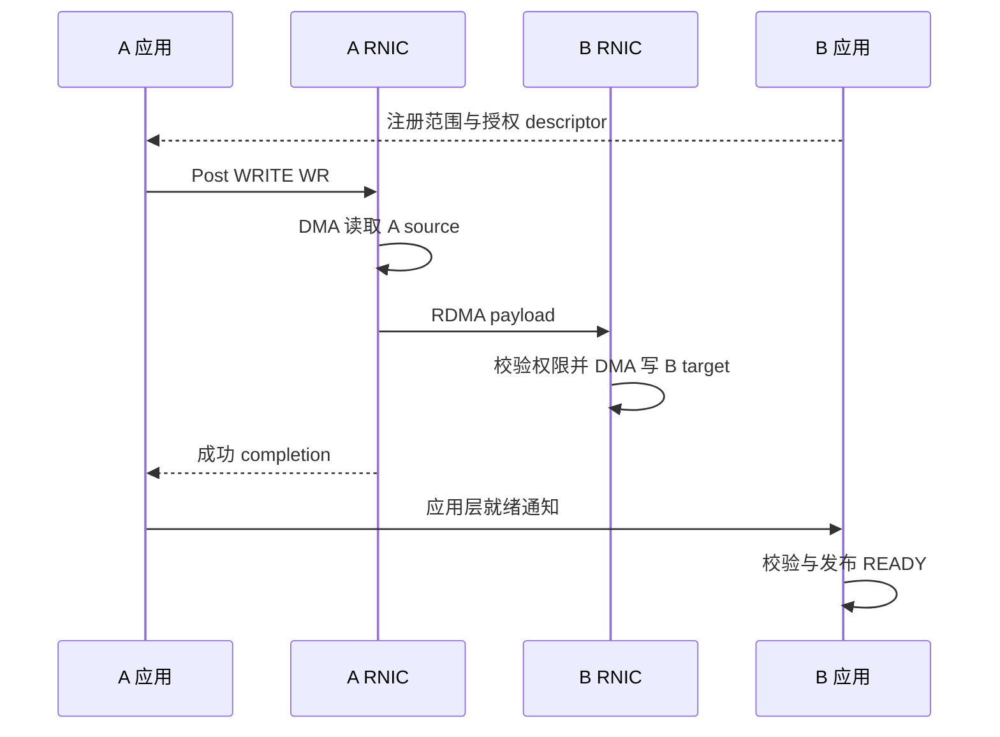
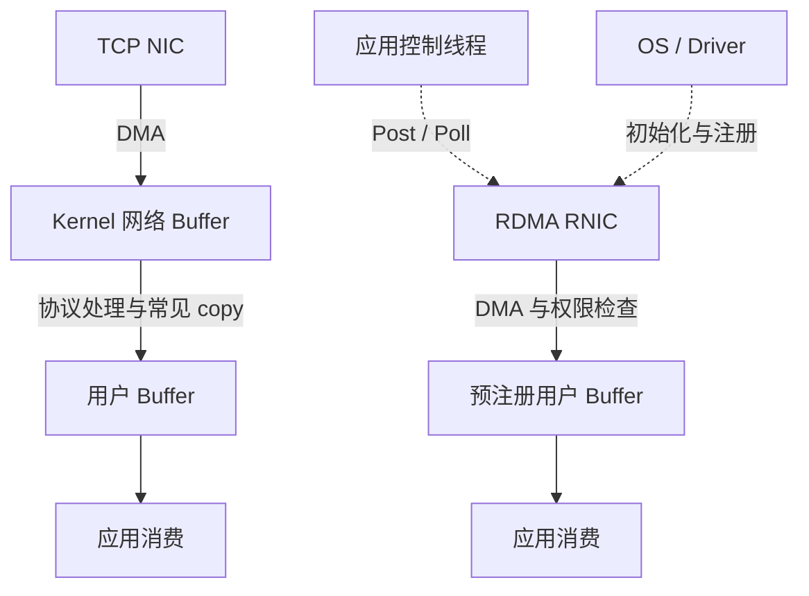
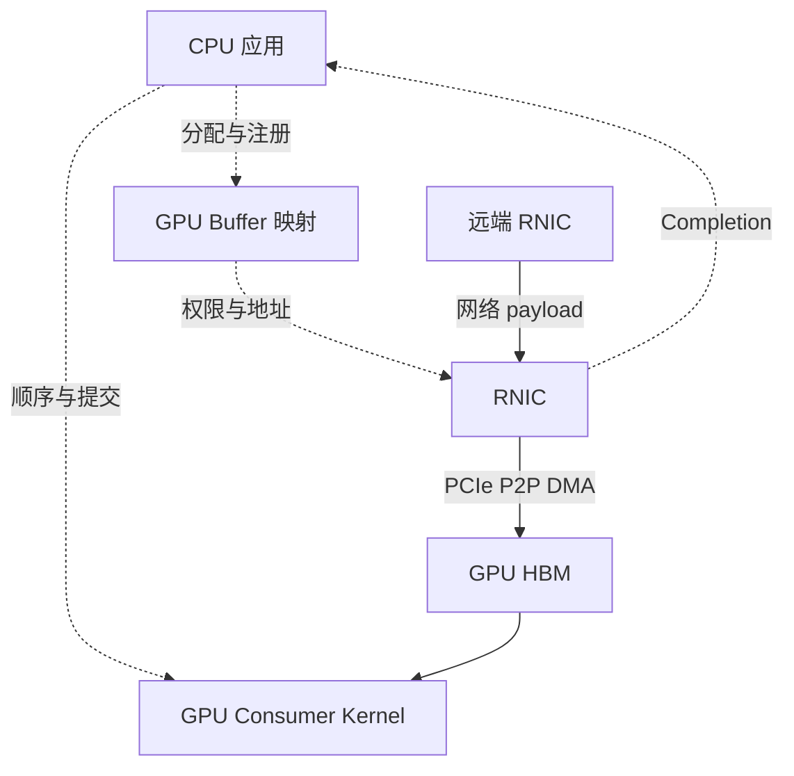
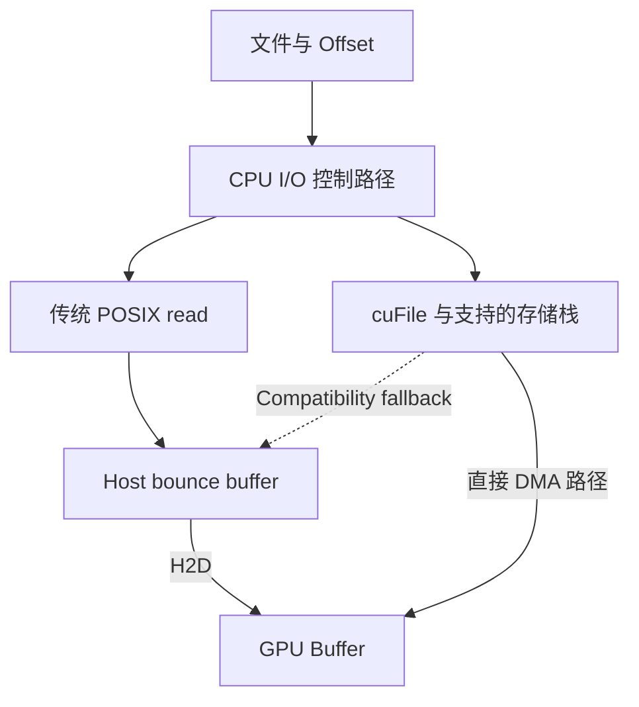
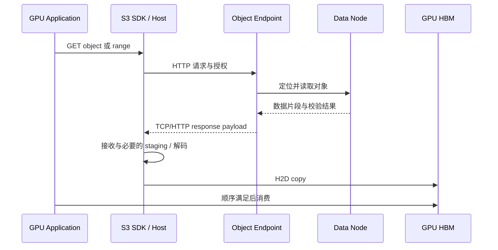
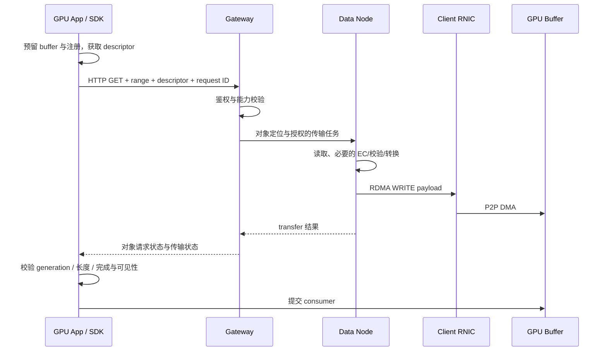

# GPU Data Path: CUDA, RDMA, GPUDirect and S3

> Document 2 · 数据路径教程 · Java → Systems Programming 的最小桥梁  
> 核实日期：2026-09-19。CUDA Runtime / GPUDirect RDMA 在线页面显示 13.4；cuObject 页面更新于 2026-09-17。它们是本次核对的文档快照，不代表任意环境都具备相同支持。
> 面试版修订：2026-09-20；本次复核 CUDA 同步/异步说明、verbs MR/post-send 与 cuObject 页面。新增时序与性能案例为教学假设。

## 目录

- [0. 阅读目标与优先级](#chapter-0)
- [1. 先建立硬件数量级 — MUST KNOW](#chapter-1)
- [2. 必要 C++：所有权和异步生命期 — MUST KNOW / SHOULD KNOW](#chapter-2)
- [3. CUDA：只学数据移动和顺序 — MUST KNOW](#chapter-3)
- [4. Path A / B / C：每一步到底谁在搬 — MUST KNOW](#chapter-4)
- [5. RDMA：完整解释一次远端内存访问 — MUST KNOW](#chapter-5)
- [6. GPUDirect：三个概念必须分开 — MUST KNOW](#chapter-6)
- [7. S3 + RDMA + GPU：对象语义与搬运机制分开 — MUST KNOW](#chapter-7)
- [8. 把性能与路径说成可验证的结论 — SHOULD KNOW](#chapter-8)

<a id="chapter-0"></a>

## 0. 阅读目标与优先级

本篇反复回答四个问题：**bytes 在哪里？谁拥有 buffer？谁搬运？什么时候消费才安全？**

| 等级 | 范围 |
|---|---|
| MUST KNOW | host/device、pinned memory、DMA、Stream/Event、MR/QP/CQ、READ/WRITE、GPUDirect 区别、S3 控制与数据路径 |
| SHOULD KNOW | 必要 C++、NUMA/拓扑、verbs 生命周期、错误定位、cuObject 的具体限制 |
| NICE TO KNOW | Unified Memory 的平台差异、ODP、DC transport、NIXL/UCX 在栈中的位置 |
| SKIP FOR NOW | PTX/SASS、Tensor Core 编程、CUTLASS、模板元编程、ABI 细节、RDMA driver/firmware、PCIe 电气层 |

正文中的 C++/CUDA 小片段用于解释 lifetime 与顺序，不是一套完整 Demo。Demo 的实现边界在 Document 3。

**一个月的掌握边界：**C++ 要能判断谁拥有资源、哪段引用会悬空；CUDA 要能画 copy/compute 的依赖；RDMA 要能沿一次 WRITE 解释 MR、QP、CQ 与完成。能读懂接口、指出错误并说明修正思路就达标，不要求闭卷写出完整 verbs 建链程序。

读 API 表时只记“输入资源 → 提交动作 → 完成条件”。ODP、DC、GPU flush 的具体 API 参数是查文档内容；知道它们为何影响正确性即可。若目标 JD 明确要求 C++ coding，另安排语言练习，不能把这篇阅读完成等同于通过 C++ 编程面试。

<a id="chapter-1"></a>

## 1. 先建立硬件数量级 — MUST KNOW

### 1.1 内存与互连不是同一种东西

- **GPU** 是计算设备；**HBM** 是部分数据中心 GPU 使用的高带宽本地内存。并非所有 GPU 都用 HBM，也有 GDDR GPU。
- **Host memory** 通常是 CPU 系统 DRAM；**device memory** 通常是某张 GPU 的本地内存。
- **PCIe** 是连接 CPU/root complex、NIC、NVMe、GPU 等设备的互连；它不是另一层存储。
- **NVLink** 是 NVIDIA 的高速互连。GPU↔GPU 与特定 CPU↔GPU 的 NVLink-C2C 是不同形态，不能假设普通 x86 主机 DRAM 自动按 GPU NVLink 标称带宽访问。
- **NUMA** 意味着“哪颗 CPU、哪组 DRAM、哪张 NIC/GPU”会影响访问路径。远端 socket 内存可能增加跳数与争用。



### 1.2 带型号的参考数字

下面只比较量级，不把理论峰值当实测。带宽单位统一为十进制 byte/s，特别注明方向。

| 硬件 / 链路 | 参考数值 | 正确解读 |
|---|---|---|
| NVIDIA H100 SXM | 80 GB HBM；3.35 TB/s memory bandwidth | 单 GPU 本地内存规格，不是远端读取速度 |
| NVIDIA H200 | 141 GB HBM3e；4.8 TB/s memory bandwidth | 同样是本地内存标称带宽 |
| H100 SXM NVLink | 900 GB/s 标称聚合互连带宽 | 不能当成单个单向 memcpy 的必达值 |
| AMD EPYC 9654 | 12 个 DDR5 通道，最高 4800 MT/s；每 socket 460.8 GB/s | 满配置理论规格；普通 memcpy、NUMA 访问和混合负载会更低 |
| PCIe 4.0 x16 | 约 31.5 GB/s 单向，编码后、TLP 等开销前 | `16 GT/s × 16 × 128/130 ÷ 8` |
| PCIe 5.0 x16 | 约 63.0 GB/s 单向，同一口径 | `32 GT/s × 16 × 128/130 ÷ 8`；不是 128 GB/s 单向 |
| NVIDIA ConnectX-7 Ethernet | 型号系列最高总计 400 Gbps | 即原始 50 GB/s；不能把多个端口标称值无条件相加 |

规格来源：[NVIDIA H100](https://www.nvidia.com/en-us/data-center/h100/)、[NVIDIA H200](https://www.nvidia.com/en-us/data-center/h200/)、[AMD EPYC 9654](https://www.amd.com/en/products/processors/server/epyc/4th-generation-9004-and-8004-series/amd-epyc-9654.html)、[ConnectX-7 Datasheet](https://www.nvidia.com/content/dam/en-zz/Solutions/networking/ethernet-adapters/connectx-7-datasheet-Final.pdf)。PCIe 表为按链路速率推导的理论值，H100 页面给出的 PCIe 128 GB/s 是近似双向聚合规格，不能拿来计算单向传输时间。

**面试推论：**H200 本地 4.8 TB/s 与 400 Gbps 网络的 50 GB/s 相差约 96 倍。即使 RDMA 消除多余拷贝，网络也不会变成 HBM。

延迟也不能混比：CPU 一次 cache-miss load、GPU 一次全局内存读取、一个 CUDA API 提交、一次 NVMe I/O、一次 S3 GET，不是同一操作。内存访问可按百 ns～µs 量级理解，设备提交是 µs 级起，NVMe 请求通常再高，网络对象 GET 往往进入 ms 级；这些是工程数量级假设，不是上述型号的实测延迟。

### 1.3 如何判断瓶颈

稳定流水的带宽上限近似为路径中最慢一段：

`B_effective ≤ min(B_backend, B_network, B_PCIe, B_memcopy, B_conversion)`

串行阶段的延迟则近似相加。只有真正以 chunk 流水、具有足够队列与缓冲、且资源不冲突时，才能把稳态耗时看成最慢一段。PCIe switch 上行链路还可能被多块 NVMe 与 NIC/GPU 同时共享。

### Interview Check

**30 秒回答 — What role does PCIe play?**

> PCIe connects devices such as GPUs, NICs and NVMe drives. It carries host-to-device and peer-to-peer traffic, and can limit the data path even when HBM is much faster. I check link generation, lane width, shared topology, direction, and actual payload throughput.

**2 分钟回答**

我把内存介质与互连分开。HBM 是 GPU 本地工作集，DRAM 是 host 工作集；PCIe 和 NVLink 是它们或其他设备之间的通道。H200 本地 HBM 是 TB/s 量级，而 400 Gbps 网络仅是 50 GB/s 原始线速，因此远端 KV 不可能透明地等价于 HBM。PCIe 5 x16 单向编码后约 63 GB/s，还要扣除协议和拓扑争用；产品宣传的双向聚合不能直接用于单向计算。实际瓶颈取决于后端读取、网络、Host staging、PCIe 与布局转换。我的排查会先确认 GPU/NIC/DRAM 的 NUMA 和 PCIe 位置，再分段测量，而不会只看一张 NIC 的标称速率。

**Deep Dive**

1. **Q：两张 400G NIC 接一条 PCIe 5 x16 上行，能给 GPU 100 GB/s 吗？** A：不能无条件成立；两张卡及 GPU 的共同路径可能被约 63 GB/s 单向链路限制。
2. **Q：DMA 跨过 CPU root complex 就算 CPU copy 吗？** A：不是。流经互连/根复合体，不等于 CPU core 执行 memcpy，也不等于 payload 进入 DRAM。
3. **Q：Bandwidth 够大为什么 p99 仍差？** A：排队、分片、小请求固定成本、共享链路、注册/分配、同步或后台流量都能抬高尾延迟。

**Common Trap：**Gbps 当 GB/s；双向当单向；HBM 带宽当 PCIe 带宽；NVLink 等于统一 DRAM；CPU 不拷贝等于 CPU 完全不参与。

<a id="chapter-2"></a>

## 2. 必要 C++：所有权和异步生命期 — MUST KNOW / SHOULD KNOW

所有权、指针、RAII 与异步回收为 MUST KNOW；其余语法只要求 SHOULD KNOW。

### 2.1 从 Java 的 `Foo foo = new Foo()` 开始

Java 变量通常保存受 GC 管理的对象引用；C++ 要把“对象本体、借用地址、拥有者”说清楚。

| C++ 表达式 | 含义 | Lifetime / ownership | 在数据路径中为什么用 |
|---|---|---|---|
| `Foo foo;` | 创建对象本体 | 局部变量通常是自动存储期，离开作用域析构 | 小型 descriptor、锁 guard、资源 wrapper |
| `Foo* p = &foo;` | 存放地址，可空、可改指向 | 裸指针本身不表达 ownership | CUDA/verbs 的 C API 接受地址 |
| `Foo& r = foo;` | 现有对象的别名 | 非 owning；不延长普通对象生命期；不能重新绑定 | 不复制 manager/buffer 的同步参数 |
| `std::unique_ptr<Foo>` | 独占拥有动态对象 | 默认销毁时 delete；可定制 deleter | buffer、MR、QP 的唯一拥有者 |
| `std::shared_ptr<Foo>` | 引用计数共享拥有 | 最后 owning 引用释放时析构 | 异步请求共同持有 transfer context |
| `Foo&& r` | rvalue reference | 允许表达可移动对象；声明本身不转移资源 | 接收 ownership 转移，避免大 buffer 拷贝 |

**Stack / heap：**局部 wrapper 可能在栈上，wrapper 拥有的大数组在堆上；GPU allocation 又在 device memory。不能仅看变量声明位置判断它指向的 payload 在哪。`new Foo` 返回地址，`delete` 必须匹配；现代代码优先用 RAII，避免到处手动释放。

### 2.2 Pointer、reference 与 const 的精确意思

```cpp
void inspect(const Buffer& b);   // 借用对象，通过 b 不修改它
void fill(std::byte* dst, size_t n); // 借用 n 字节可写空间
const std::byte* p;              // 不能通过 p 改 payload，p 自己可改
std::byte* const fixed = data;   // fixed 不改指向，payload 可改
```

`const` 不是 immutable 的全局证明：其他 alias 或设备仍可能写这块内存。`const Buffer&` 也不保证后台 DMA 已完成。C++ 类型层权限、MR 的硬件访问权限、GPU 的执行顺序是三件事。

指针运算按元素大小前进。`float* p; p+1` 是加 4 bytes（通常 float 为 4 B），不是加 1 byte。I/O 接口常用 byte pointer 和明确 byte count，避免把元素数与字节数混用。

**悬空指针：**函数返回后局部对象已销毁，但异步任务还保存 `&local`，就会发生 use-after-free。C++ 不像 Java 那样因为某处保存了裸指针就自动延长对象生命期。

### 2.3 RAII、destructor 与 move

**RAII** 是把资源释放绑定到拥有者的 lifetime。资源不仅是内存，也可以是文件句柄、CUDA stream、MR、QP、锁。正常返回或异常展开都会析构已构造的局部对象。[C++ Core Guidelines：资源管理](https://isocpp.github.io/CppCoreGuidelines/CppCoreGuidelines#S-resource)

```cpp
auto a = std::make_unique<Buffer>(n);
auto b = std::move(a);
// b 成为拥有者；此处 a 已为空。payload 无需复制 n 字节。
```

`std::move` 只是把表达式转换成可被移动的形式；实际转移由类型的 move constructor/assignment 完成。`Foo&&` 变量有名字后，表达式本身仍是 lvalue，需要时再显式 `std::move`。这里懂意思即可，不研究 value category 全体系。

**析构不是异步完成通知。** 一个 `GpuBuffer` wrapper 可以在 destructor 里释放 device allocation，但必须先确保 kernel、DMA 和远端访问均不再使用它。常用设计是请求 context 持有 buffer lease，completion 回收 lease，池再允许重用。

为 CUDA 内存用默认 `unique_ptr<T>` 的 `delete` 是错的；要用调用 `cudaFree` 的 deleter/wrapper。Pinned allocation 对应 `cudaFreeHost`；RDMA MR 对应 `ibv_dereg_mr`。此外，注销 MR 要早于释放底层内存，且晚于所有访问完成。

### 2.4 Containers、types、lambda、template

| 特性 | Java 对照与必要解释 | Systems code 用途 / 易错点 |
|---|---|---|
| `std::vector<T>` | 类似可增长数组，但元素通常按值连续存放 | 保存 descriptor/数据；扩容可能移动元素并使旧 pointer/reference 失效；普通 vector 内存不自动 pinned |
| `std::unordered_map<K,V>` | 类似 HashMap | key→block metadata；并发写需同步，迭代器失效规则要看具体操作 |
| `class` / `struct` | 都可有方法、构造和析构；默认访问权限不同 | 用 struct 表示数据记录，class 包装不变量；不要把任意 struct 原样当跨网线格式 |
| `enum class Tier` | 有作用域的枚举，限制隐式混用 | 表达 Host/GPU、READY/FAILED 等状态 |
| Lambda `[x]` / `[&x]` | 值捕获 / 引用捕获 | completion callback；引用捕获不能超出 x 的 lifetime |
| `template<typename T>` | 编译期泛型；不是 Java 类型擦除机制 | 同一 buffer/算子支持不同元素类型；只读懂简单类型参数 |
| Alignment | 地址按指定字节边界对齐 | DMA、direct I/O、SIMD；要求取决于 API，不是所有 RDMA 都要求 4 KiB |

`alignas(64)` 控制对象对齐，不会自动 pin 住内存，也不让它被 RNIC 注册。对象序列化要显式处理 padding、endianness、版本与字段长度，不能把 C++ 对象内存布局当稳定协议。

**一个真正影响正确性的例子：**先把 `vector.data()` 注册成 MR，然后 `push_back` 导致扩容，旧 MR 仍可能指向旧 allocation。避免方式是使用固定容量的注册池，不在 in-flight 生命周期中改变底层地址。

### 2.5 thread / mutex / atomic

- `std::thread` 创建 host 线程；拥有者要决定 join 或其他明确的终止管理，不能带着仍 joinable 的 thread 对象直接析构。线程不是 CUDA thread。
- `std::mutex` + `std::lock_guard` 给共享 metadata 提供互斥；锁对象通过 RAII 在作用域退出时解锁。不要持目录全局锁等待网络 I/O。
- `std::atomic` 用于 host 线程共享计数/标志。原子递增不等于整个状态机原子；`refcount==0` 的检查和 eviction admission 仍要形成正确协议。
- Java 的 data race 与 C++ 的规则不同：C++ 普通变量发生未同步冲突访问可能产生 undefined behavior，不能靠“机器上应该能看到”推断。

可以用 release/acquire 发布已经完成的 **CPU 数据**。但 CPU atomic 不能代替 CUDA event 或 GPUDirect 的设备可见性协议；`atomic<bool> ready=true` 只有在真实 transfer 完成后发布才有意义。

### 2.6 一个异步任务应持有什么

不写完整类，也可以把设计说清楚：

`TransferContext = request_id + source_lease + destination_lease + registration_lease + completion_state`

提交后，由 completion 队列/事件管理器持有 context；成功、失败、超时都要走收尾。超时只是调用方不再等，不能因此假设硬件停止访问。`shared_ptr` 可以延长 context lifetime，但它的原子引用计数不让 context 的普通字段自动线程安全。

**工具链停止线：**本月会区分 `.cpp` host 编译与 `.cu` 的 CUDA 编译流程，理解 CMake target/link library，能用 gdb/lldb 看 host 堆栈和 use-after-free，知道 GPU 错误需要 CUDA 工具定位即可。不要先投入模板库和构建系统改造。

### 2.7 Java 开发者最需要做的一道代码阅读题 — MUST KNOW

下面是接口示意，`pool.borrow()` 返回一个 RAII lease，析构会把槽位还池，**该教学 pool 不自动等待设备**；`submit_h2d` 仅保存借用的地址并提交异步操作。

```cpp
void start_copy() {
    auto src = pinned_pool.borrow(bytes);
    auto dst = device_pool.borrow(bytes);
    fill(src.data(), bytes);
    submit_h2d(src.data(), dst.data(), bytes);
} // 两个 lease 析构；pool 可能立即把槽位交给其他请求
```

问题不在“用了栈变量”，而在**操作持续的时间超过拥有者持续的时间**。源可能被另一请求重填，目标可能在 DMA 尚未结束时被分配给其他 consumer。若一个真实 wrapper 的析构选择等待，则可能避免这类错误，却把异步热路径变成阻塞；不能依赖未说明的析构行为。

修正思路是让 completion 管理的 `TransferContext` 持有两个 lease，提交后把 context 的 ownership 转给在途队列。H2D 完成后可释放源；目标的 ownership 则交给 consumer，直到 consumer 完成才回池。`std::move` 可以移交 lease，payload 本身无需移动。

同样检查 lambda：`[&context]` 捕获局部变量引用，变量退出后可能悬空；`[context]` 若捕获的是 owning `shared_ptr` 可以保活，但 context 内部若仍只有裸 buffer 指针，底层 allocation 依然没有被保活。会沿这两层追踪 ownership，比背所有智能指针构造函数更有用。

**达标答案：**分别指出源保活到 copy 完成、目标保活到最后 consumer 完成；说明 callback 的 lifetime 与 payload 的 lifetime 都要检查。MR 资源在 §5 加入后，同样进入这个拥有关系。

### Interview Check

**30 秒回答 — Why does C++ ownership matter here?**

> CUDA and RDMA operations often outlive the function that submits them. The source, destination and memory registration must remain valid until the relevant completion. I use RAII for resource ownership and explicit leases for in-flight operations, rather than assuming a raw pointer or a returned API call proves the buffer is safe to free.

**2 分钟回答**

Java 开发者容易把对象引用理解成自动保活，但 C++ 裸指针只是地址。异步 I/O 提交函数返回时，NIC 或 GPU 可能还在访问源和目标，所以需要显式 ownership。RAII 负责在拥有者生命周期结束时释放资源，unique_ptr 表示独占，move 传递所有权，必要时 shared_ptr 让多个异步分支持有 context。不过资源的真正回收点仍由 completion 决定，而不是函数退出或计时超时。注册 buffer 还必须保持地址稳定；vector 扩容就可能破坏 MR。并发 metadata 用 mutex/atomic 管理，但 CPU 同步不能替代 CUDA/RDMA 设备同步。这些才是本岗位需要的 C++ 核心，不是复杂语言技巧。

**Deep Dive**

1. **Q：RAII 能自动解决所有 use-after-free 吗？** A：不能；它只执行定义好的拥有关系，不知道外部设备的在途访问，必须正确设计 lease。
2. **Q：shared_ptr 能保证 buffer 写入安全？** A：只解决共享 lifetime，payload 并发读写仍需同步。
3. **Q：超时就注销 MR 行吗？** A：不能。需要确认 QP/操作进入安全终止、flush/completion 被处理或访问能力撤销完成，再释放内存。

**Common Trap：**`std::move` 等于 DMA；引用自动延长任意对象生命期；`const` 等于硬件只读；mutex 可以同步 GPU；智能指针可以忽略 completion。

<a id="chapter-3"></a>

## 3. CUDA：只学数据移动和顺序 — MUST KNOW

### 3.1 五个执行概念

| 概念 | 一句话解释 | 本月需要理解到哪里 |
|---|---|---|
| Host | 运行 CPU 程序、提交 GPU 工作的一侧 | 负责分配、提交、同步与错误处理 |
| Device | GPU 及其执行环境 | 数据必须对该设备可访问且就绪 |
| Kernel | 在 GPU 上执行的函数 | 它是计算任务，不是 Linux kernel |
| Thread / thread block | GPU 逻辑线程及其协作分组 | 一个 block 内可共享片上 shared memory；不是 KV block |
| Grid | 一次 kernel launch 的 thread blocks 集合 | 读懂 `kernel<<<grid, block, ..., stream>>>` 即可 |

GPU **global memory** 通常指可被设备线程访问的设备内存地址空间；在本文硬件例中主要落在 HBM。**Shared memory** 是每个 thread block 可用的片上工作区，不是 CPU/GPU 共享的 Host DRAM。kernel 的线程层次只用来理解谁消费 buffer，不做极限优化。[CUDA C++ 官方入门](https://docs.nvidia.com/cuda/cuda-programming-guide/02-basics/intro-to-cuda-cpp.html)

### 3.2 最小 API 表

| API | 做什么 | 生命周期/路径注意点 |
|---|---|---|
| `cudaMalloc` | 分配 device memory | CPU 获得的是设备指针，不能一般地在 host 解引用 |
| `cudaFree` | 释放 device allocation | 热路径应复用池；不能拿它代替完整设备访问生命周期协议 |
| `cudaMallocHost` / `cudaHostAlloc` | 分配 page-locked host memory | 对应 `cudaFreeHost`；不是分配 HBM |
| `cudaHostRegister` | 把已有 host 区域注册为 page-locked 等用途 | 完成后 unregister；具体支持取决于平台 |
| `cudaMemcpy` | 按指定方向发起拷贝 | “同步”行为依方向和内存类型，不等于所有情形全设备同步 |
| `cudaMemcpyAsync` | 在指定 stream 中排队传输 | host 返回与 device 完成分离；pageable buffer 可能阻塞 |
| `cudaStreamCreate` | 创建有序工作流 | 一个 stream 是顺序关系，不是一个 CPU thread |
| `cudaEventRecord` | 在 stream 中记录一个完成点 | 事件完成意味着此前该 stream 的工作到达此点 |
| `cudaStreamWaitEvent` | 让另一个 stream 等待事件 | 建立跨 stream 的设备依赖，通常不要求 host 阻塞 |
| `cudaEventSynchronize` | host 等待指定 event | 比每次全设备同步更局部 |

CUDA API 有错误返回；kernel 异步执行错误可能在后续同步处暴露。不能只检查 launch 那一行是否返回成功。

### 3.3 Pageable vs pinned

普通 `malloc/new/vector` 得到的 host memory 在常见离散 GPU 系统上通常是 **pageable**：OS 可以管理其驻留与映射。设备 DMA 需要可靠的访问映射及生命周期。CUDA 可先把 pageable 数据复制到内部 pinned staging buffer，再安排 H2D。

**Pinned/page-locked memory** 保持这些 host pages 可供 DMA 使用，省掉常见的 pageable→pinned staging。它使可预测的异步 H2D/D2H 与计算重叠成为可能，但申请/pin 有成本，过量 pin 会挤压系统可分页内存。应采用有上限的长期 buffer pool，而不是每个 4 KiB 请求临时 pin/unpin。

Pinned 不要求应用看到的内存物理连续。虚拟连续区域可由多个物理页构成，由映射/IOMMU/设备机制支持 DMA；具体机制不需要本月深挖。

### 3.4 `cudaMemcpy` vs `cudaMemcpyAsync` 的准确边界

下面对应本次核对的 CUDA Runtime synchronization 文档：

| 调用情形 | Host 何时可能返回 | 你该如何处理 |
|---|---|---|
| 同步 API，pageable H2D | staging copy 完成后可能返回，最终 DMA 可能尚未完成 | 别把函数返回推导成所有设备工作都完成 |
| 同步 API，pinned H2D | 对 host 同步 | 仍不要据此推导其他 stream 的任意工作已完成 |
| 同步 API，D2H | 拷贝完成后返回 | host 才能消费结果 |
| 同步 API，D2D | 不进行 host-side synchronization | 后续消费仍需正确设备顺序 |
| Async API，pageable H2D/D2H | 可能对 host 同步或 staging | 不能保证 copy/compute overlap |
| Async API，pinned H2D/D2H | 通常提交后返回 | 等对应 completion 后才能改写/回收源或消费目标 |

任何 CUDA API 都可能因资源或内部原因阻塞；Async 不是“永不阻塞”的承诺。[CUDA Runtime API synchronization behavior](https://docs.nvidia.com/cuda/cuda-runtime-api/api-sync-behavior.html)

### 3.5 Stream 与 Event：把两张时间表连起来

同一个 stream 内按序执行；不同 stream 之间，除非有依赖或其他规则，不应假定先后顺序。想重叠数据搬运与计算，需要硬件能力、pinned buffer、独立工作、合理 stream 与避免隐式同步。

以下是**顺序示意片段**，省略 allocation、错误处理和资源封装；`checked` 表示检查 API 返回值，不是 CUDA API：

```cpp
checked(cudaMemcpyAsync(device, pinned_host, bytes,
                        cudaMemcpyHostToDevice, copy_stream));
checked(cudaEventRecord(copy_done, copy_stream));
checked(cudaStreamWaitEvent(compute_stream, copy_done, 0));
consume<<<grid, block, 0, compute_stream>>>(device, bytes);
checked(cudaEventRecord(consume_done, compute_stream));

// 回收两个不同资源有两个不同的最早时间：
checked(cudaEventSynchronize(copy_done));    // host 源 buffer 可重填
checked(cudaEventSynchronize(consume_done)); // device buffer 可重用
```

`copy_done` 只保证这一份数据拷完，不保证后面的 consumer kernel 已经不再读取 device buffer。两个 buffer 不能用同一个模糊的“done”状态管理。



示意图的重叠是目标行为，不是仅创建两个 stream 就保证发生。若 NIC、GPU copy engine、计算都争用同一内存带宽，重叠还可能互相变慢。[CUDA Asynchronous Execution](https://docs.nvidia.com/cuda/cuda-programming-guide/02-basics/asynchronous-execution.html)

### 3.6 UVA vs Unified Memory vs mapped host memory

| 概念 | 它提供什么 | 它不保证什么 |
|---|---|---|
| UVA，Unified Virtual Addressing | 统一的虚拟地址布局，可识别 CPU/不同 GPU 地址范围 | 不自动把 CPU DRAM 变成 HBM；不自动授予 RNIC 访问权限 |
| Unified Memory，例如 `cudaMallocManaged` | 可由 CPU/GPU 使用的 managed allocation，按平台支持迁移/映射/一致性 | 不保证无 page fault、无 PCIe 流量或低尾延迟 |
| Mapped pinned host memory | 在支持配置下，GPU 可以直接访问 host pages | 物理数据还在 host；可能经 PCIe 每次访问 |

UVA 是地址问题；Unified Memory 是驻留/访问管理问题；GPUDirect 是设备间数据路径问题。三者相关但不能互换。现代硬件一致性、HMM、ATS 等会改变具体路径，本月只需知道“平台特定”，不要背“统一内存一定拷贝”或“一定不拷贝”。[CUDA Unified and System Memory](https://docs.nvidia.com/cuda/cuda-programming-guide/02-basics/understanding-memory.html)

**为什么 cache manager 常用显式分配与搬运？** 它需要知道某块在哪、需要多少带宽、何时可用、何时回收；隐式缺页迁移可能把等待藏进 kernel，增加不可预测性。Unified Memory 适合某些开发和工作负载，但不会自动替你实现 prefix 热度、租户配额与 deadline。

### 3.7 双缓冲不是两个指针：用四个 chunk 走时间轴 — SHOULD KNOW

假设四个独立 chunk，每个 H2D 4 ms、consumer kernel 6 ms；copy 与 compute 能独立重叠，暂不计争用和提交开销。这些是教学输入。

完全串行耗时 `4×(4+6)=40 ms`。使用两组 host/device buffer A、B，并遵守完成依赖，一种调度如下：

| Chunk | 使用 buffer 组 | H2D 时间区间 | Consumer 时间区间 | 复用约束 |
|---|---|---|---|---|
| 1 | A | 0～4 ms | 4～10 ms | A 的 device 到 10 ms 才可覆盖 |
| 2 | B | 4～8 ms | 10～16 ms | 等 compute engine 空闲后消费 |
| 3 | A | 10～14 ms | 16～22 ms | 不能在 8 ms 就覆盖仍被 chunk 1 使用的 A |
| 4 | B | 16～20 ms | 22～28 ms | 等 chunk 2 consumer 结束后覆盖 B |

该假设下总计 28 ms；无限多 chunk 的稳态间隔接近较慢的 6 ms。源 host buffer 可在相应 H2D 后提前重填，表中按两组配对 buffer 简化展示。实现时用事件记录每个槽位的 copy_done 与 consume_done，不能只用一个全局 busy 标志。

如果最后仍测到 40 ms，先检查是否每次都 host synchronize、是否用了 pageable staging、是否存在 stream 隐式依赖；如果 copy 和 compute 重叠后各自变慢，再看 HBM 或互连争用。CUDA 是否能并发执行取决于设备与工作条件，见 [CUDA 异步执行说明](https://docs.nvidia.com/cuda/cuda-programming-guide/02-basics/asynchronous-execution.html)。

本月应会读这张时序表，能解释两个回收时刻；无需实现通用异步执行框架。

### Interview Check

**30 秒回答 — Why is pinned memory important?**

> Pinned host memory provides a stable DMA-accessible buffer and avoids the usual pageable-to-pinned staging copy. It is important for predictable asynchronous host-device transfers. The buffer still lives in host DRAM, consumes a limited resource, and must stay valid until the transfer completes.

**2 分钟回答**

在常见离散 GPU 上，普通 host memory 是 pageable，CUDA 可能先把它拷到 pinned staging，再让 DMA 送往 device。应用使用有界 pinned buffer pool 可以避免这次 staging，降低 CPU/DRAM 开销，并更可靠地使用 cudaMemcpyAsync 与计算重叠。但 Async 返回只表示已提交，不表示 DMA 或 consumer kernel 已完成。一个 stream 内按序，跨 stream 要用 event 建依赖；源 buffer 在 copy_done 后可重填，目标在最后消费者完成后才可复用。Pinned 仍是 CPU DRAM，不是 HBM，也不同于 UVA 或 Unified Memory。我的关注点是实际 copy 路径、host 是否阻塞、资源寿命与错误如何被观察。

**Deep Dive**

1. **Q：Async 用 pageable pointer 一定报错吗？** A：不能这么概括。部分路径允许并进行 staging/阻塞，关键是不能据此保证异步重叠；以对应 API 和平台规则为准。
2. **Q：同一个 stream 里 copy 后 launch，需要每次 host synchronize 吗？** A：通常靠 stream 内顺序即可建立依赖，不需每步阻塞 host；跨 stream 要显式建立关系。
3. **Q：CPU Event 完成能证明 RNIC 的外部写已被 GPU 看见吗？** A：普通 CUDA event 不自动包含 RNIC 工作，必须使用传输后端支持的 completion/visibility 集成协议。

**Common Trap：**Async 等于完成；所有 memcpy 都阻塞整个 device；Unified Memory 等于 GPU 直接从对象存储取数据；CUDA block 等于 KV page。

<a id="chapter-4"></a>

## 4. Path A / B / C：每一步到底谁在搬 — MUST KNOW

### 4.1 DMA 的准确解释

**DMA，Direct Memory Access**：由设备的数据搬运硬件按事先设置的地址、长度与映射访问内存，CPU 不逐 byte 执行拷贝。CPU/驱动仍负责提交、映射、调度、通知和错误处理。

NIC 本来就常用 DMA 把包放到 host memory，所以“用了 DMA”不等于“用了 RDMA”，也不等于“数据直达 GPU”。RDMA 把受保护的远端内存访问语义通过网络暴露给应用；GPUDirect 则进一步让某些设备访问 GPU memory。

### 4.2 三条路径对照



| 阶段 | CPU 做什么 | OS kernel / driver 做什么 | 硬件做什么 | 数据移动 |
|---|---|---|---|---|
| A：pageable→pinned staging | 运行 runtime/拷贝逻辑 | 管理锁页、映射及相关资源；并非每次都重新注册 | 通常由 CPU 执行 host copy | 多一次 host→host copy |
| A/B：pinned→GPU | 提交 DMA，管理 stream | 必要设置/映射/调度；不必每 byte 介入 | GPU copy engine 经互连读 host、写 device | 一次 host→device 传输 |
| C：RNIC→GPU | 提交 WR/控制请求，观察 completion | 预先建立 GPU peer/DMA 映射与保护 | RNIC 经支持的 PCIe 路径写 GPU | 避免接收端 host bounce buffer |
| C：NVMe/存储→GPU | 发起 I/O、管理 file/range | 文件系统、存储与 GPU driver 协同 | 支持路径的存储侧 DMA 写 device | 可避免应用端 host staging |

**限定：**Path B 只有在数据已经在 pinned buffer 中，或上游直接填入它时，才省掉 staging。若先读到一个普通 vector，再 memcpy 到 pinned pool，这次 host copy 仍存在，只是由你显式执行。

Path C 不等于存储服务器也完全没有 DRAM buffer，也不等于没有 EC 解码、解密、布局转换或中间 GPU buffer。要注明省掉的是哪一段。

### 4.3 用一个假设 chunk 看收益

64 MiB 数据，假设 host memcpy **有效 payload 吞吐** 20 GiB/s，H2D 有效 25 GiB/s：

- Host staging：`64/1024 ÷ 20 s = 3.125 ms`。
- H2D：`64/1024 ÷ 25 s = 2.5 ms`。
- 两段完全串行约 5.625 ms，未算提交、读取和排队。
- 数据直接在 pinned pool 中时可少掉 3.125 ms 这一阶段；如果上游仍复制一次，就没有凭空消失。

这不是硬件实测。Host memcpy 读源并写目标，DRAM traffic 通常至少约 2×payload，可能还有缓存影响；因此 payload GB/s 与内存总线流量 GB/s 不能混为一谈。

### 4.4 Zero-copy / copy avoidance 应怎样说

“Zero-copy” 必须限定边界。例如：“消除了 socket buffer 到用户 buffer 的复制”“避免 client DRAM bounce”“直接 DMA 到目标 GPU allocation”。数据依然通过 NIC、PCIe 和 HBM controller，仍消耗链路带宽；有时仍要做 server buffer、数据转换或校验。

**面试更稳妥的表述：**“这条路径避免了一次 host staging copy，并降低 CPU/DRAM 流量；是否端到端无额外复制，需要逐段验证。”

### Interview Check

**30 秒回答 — What is DMA / zero-copy?**

> DMA lets a device move bytes using configured memory mappings without the CPU executing the payload copy. Zero-copy describes the removal of specific intermediate copies, not the absence of physical data movement. I always state which buffers and boundaries are being bypassed.

**2 分钟回答**

传统路径可能先让 NIC 或存储设备把数据送到 host，再由 CPU/runtime 复制到 pinned staging，最后由 GPU copy engine 搬进 HBM。Pinned 路径可以消除 staging，GPUDirect 支持的路径进一步让 RNIC 或存储设备直接访问 GPU buffer。三种情况下 CPU 都可能负责分配、认证、提交和完成处理，区别是 payload 是否经过 CPU 拷贝和 host DRAM。不能仅因链路经过 root complex 就说经过 CPU memcpy，也不能说 DMA 就是 RDMA。Zero-copy 的正确讨论方式是画出源、目标和中间 buffer，明确消除了哪次复制，随后测量带宽、CPU 成本和尾延迟。

**Deep Dive**

1. **Q：RDMA 到 CPU DRAM 再 H2D，是 GPU-direct 吗？** A：不是，它只是网络段 RDMA，GPU 段仍有 host staging/传输。
2. **Q：省一次 copy，一定吞吐翻倍？** A：不一定；如果网络或磁盘更慢，只可能降低 CPU 成本或尾延迟，吞吐仍受最慢一段限制。
3. **Q：为什么直达后 GPU 还可能等待？** A：读后端、排队、注册、可见性同步、layout conversion 都仍存在。

**Common Trap：**DMA 等于 RDMA；zero-copy 等于零流量；CPU bypass 等于零 CPU；host buffer 被省掉等于全部存储栈被省掉。

<a id="chapter-5"></a>

## 5. RDMA：完整解释一次远端内存访问 — MUST KNOW

### 5.1 InfiniBand / RoCEv2 / RNIC / verbs 的层次

| 名称 | 所在层次 | 不要混淆 |
|---|---|---|
| RDMA | 远端内存访问与消息传递能力 | 不是某一种网线，也不是 S3 API |
| InfiniBand | 定义网络链路、交换、传输等的体系 | 原生支持 RDMA；不是“高速以太网”的别名 |
| RoCEv2 | 在 Ethernet 的 UDP/IP 封装中承载 RDMA transport | 可 IP 路由；不是应用调用 UDP socket 后自己实现所有 RDMA |
| RNIC / HCA | 执行 RDMA 的硬件适配器 | HCA 常见于 IB 语境；普通 NIC 不一定提供 verbs 能力 |
| Userspace verbs / libibverbs | 应用创建资源、提交工作和读取完成的接口 | 接口抽象不等于线上的网络协议 |
| `rdma_cm` | 连接/地址等建立辅助机制 | 不负责代替应用定义对象语义 |

RoCEv2 的 UDP/IP 便于路由，但可靠性由所选 RDMA transport（例如 RC）及硬件协议提供，不能从“有 UDP”直接推断应用传输不可靠。[NVIDIA RoCE 官方说明](https://networking-docs.nvidia.com/doca/archive/3-5-0/rdma-over-converged-ethernet)

**Kernel bypass 的准确含义：**完成初始化、映射和授权后，常见热路径可由用户态 provider 更新队列、敲 doorbell，由 RNIC 执行，无需每次 payload 传输都走传统 socket syscall/TCP 软件栈。资源创建、内存注册、连接事件、错误与设备管理仍有 kernel/driver 参与。

以下操作先按最常见的 **RC，Reliable Connection** 解释。不是所有 QP transport 都支持全部 verbs；cuObject 当前使用的 DC 在后文单独说明。

### 5.2 核心对象：沿提交过程记忆

| 对象 | 全名 / 含义 | 与一次传输的关系 |
|---|---|---|
| PD | Protection Domain | 将允许关联的 QP/MR 等资源归组，形成设备访问保护边界 |
| MR | Memory Region | 已注册的地址范围、长度、映射与访问权限 |
| QP | Queue Pair | Send Queue + Receive Queue，具有 transport/连接状态 |
| CQ | Completion Queue | 保存成功或失败 completion 的队列，可服务多个 QP |
| WR | Work Request | 应用提交的工作描述，如 READ、WRITE、SEND |
| WQE | Work Queue Element | provider/硬件工作队列中的执行描述；不要与 payload 混为一谈 |
| SGE | Scatter/Gather Element | 一段本地 buffer：address、length、lkey |
| lkey | Local key | 本地 RNIC 验证本地 buffer 访问所需的 key |
| rkey | Remote key | 远端 RNIC 验证对远端 MR 的访问所需的 key |
| CQE / WC | completion entry / 工作完成记录 | 带 wr_id、status 等，用来关联请求与资源回收 |

一句话串起来：**在 PD 下创建 MR/QP；WR 用 SGE 描述本地数据，必要时带远端 address/rkey；provider 形成 WQE；RNIC 执行；应用从 CQ 读取 completion。**

术语与用户态操作来源：[NVIDIA RDMA-aware Networks Programming Guide](https://networking-docs.nvidia.com/doca/archive/3-5-0/rdma-aware-networks-programming-guide)。本文是精简的概念模型，不把该页面中的旧速度例子当现代硬件规格。

### 5.3 为什么 Memory Registration 是核心

RNIC 不能凭任意进程发来的虚拟地址访问内存。注册至少建立：

1. 地址范围与 DMA 映射：RNIC 如何把该地址解释成可以访问的 pages。
2. 生命周期约束：设备访问时，映射与底层内存不能突然失效。
3. 权限：本地写、远端读、远端写等能力受到约束。
4. 标识：生成 lkey/rkey，把请求绑定到合法区域。

常规预注册 host memory 会 pin pages；**ODP，On-Demand Paging** 等机制允许不同的驻留管理方式，所以“所有 MR 总是一次性永久 pin 所有页”不严谨。本月先按固定注册池掌握。[libibverbs `ibv_reg_mr` 手册](https://man7.org/linux/man-pages/man3/ibv_reg_mr.3.html)

CUDA pinned 与 RNIC MR **不是同一次注册的同义词**。一块内存能做 CUDA H2D，不自动拥有 RNIC 可用的 MR/lkey；GPU allocation 又需要受支持的 peer/DMA-BUF 映射路径。

注册可能昂贵，频繁注册小 buffer 会吞掉收益，因此常缓存 registration、使用稳定 buffer pool。代价是占用锁页、NIC 映射等资源，并必须在 allocation 失效时清理注册缓存，不能只按数值地址永久记忆。

### 5.4 SEND/RECV、READ、WRITE

所有方向都以**发起操作的一侧**为基准：

| 操作 | 发起方动作 | 远端要预先做什么 | 远端应用是否每次得到普通 completion |
|---|---|---|---|
| SEND / RECV | sender 指定本地数据并发 SEND | receiver 先 post RECV，提供接收 buffer | 接收 CQ 可通知收到消息 |
| RDMA WRITE | 把本地数据写到指定远端地址/rkey | 允许 remote write，交换 descriptor | 普通 WRITE 通常不产生远端 receive CQE |
| RDMA READ | 从指定远端地址/rkey 读到本地 | 允许 remote read，保证源内容/寿命 | 普通 READ 不逐次通知远端应用 |

WRITE with immediate 可以携带通知信息，并涉及接收资源，不要把它和普通 WRITE 混在一起。SEND 的接收位置由 receiver 的 posted buffer 决定；READ/WRITE 则由发起方使用受授权的远端地址。

**SEND/RECV 不是“没用 RDMA 的退化 TCP”**：它同样可以利用注册内存、RNIC 和较少软件栈开销，只是是 two-sided 消息语义。

READ 和 WRITE 都从本地 QP 的 send queue 提交；“send queue” 的命名不意味着只支持向外发送 payload。[libibverbs `ibv_post_send` 手册](https://man7.org/linux/man-pages/man3/ibv_post_send.3.html)

### 5.5 一个 64 KiB RDMA WRITE 的完整生命周期

假设 A 生产数据，B 消费数据：

1. B 分配 target buffer，在 PD 中注册 MR，允许 remote write；为本次使用生成 generation/lease。
2. B 经认证的控制通道给 A 传 descriptor。概念字段包括地址/offset、长度、rkey、端点信息和有效期；真实协议可能封装成 opaque token。
3. A 准备 source buffer 与本地注册，创建/准备 QP，提交带 SGE 的 WRITE WR。
4. A 的 RNIC 从 source DMA 取数据，经网络发出；B 的 RNIC 校验地址/key/权限并写 target。
5. A 观察正确状态的 completion。根据应用协议发送“数据就绪”通知，或使用合适的带通知操作。
6. B 确认当前 generation、长度、完整性与内存可见性，发布 READY 给 consumer。
7. Consumer 用完后释放 lease；双方在不再有在途访问时回收 buffer/MR。



这不是生产协议，省略了连接、重试等细节，但已经把控制路径与 payload 路径分开。

### 5.6 三个 completion 误区

- **`ibv_post_send` 返回成功只是提交成功**，不证明传输完成。
- 不是每个 WR 都一定有单独成功 CQE，signaled/unsignaled 策略影响 completion；应用必须按后端顺序规则正确回收，不能丢失错误。
- 一个成功的本地 completion 不代表远端应用已经处理，也不代表数据写到 SSD、更不代表远端 GPU kernel 已正确同步读取。

轮询 CQ 不一定省 CPU：busy polling 可以用一个 core 换低延迟。事件通知减少空转，但增加唤醒/调度成本。CQ 太小、消费不及时会出错，不能把 completion 当可随意忽略的日志。[libibverbs `ibv_poll_cq` 手册](https://man7.org/linux/man-pages/man3/ibv_poll_cq.3.html)

### 5.7 TCP vs RDMA 的路径对比

以下 TCP 图表示**典型传统用户态接收路径**，不是声称所有 TCP 实现都有固定两次拷贝。TCP 也有 NIC offload、buffer 优化和零拷贝方案。



| 维度 | 常规 TCP sockets | 用户态硬件 RDMA |
|---|---|---|
| Copies | 可能有 kernel↔user copy；可优化 | 常能直接 DMA 到注册用户 buffer |
| Kernel involvement | 常规数据路径参与 syscall/TCP stack | 热路径减少参与；setup/error 仍参与 |
| CPU | 处理协议、调度与复制，亦可 offload | 提交、poll、控制逻辑仍需 CPU |
| Latency | 软件栈与调度占一定比例 | 在合适环境可降低；不是固定倍数 |
| Throughput | 高效 TCP 也可跑满链路 | 常以较低 CPU 成本达到高带宽 |
| 状态管理 | socket、stream、拥塞控制 | QP/CQ/MR、credits、注册池、传输模式 |
| 应用语义 | 有序字节流 | 消息与受保护的内存操作；需应用协议 |
| Debug | 相对成熟的网络栈工具 | 除网络外还要看 key、QP 状态、CQ 错误、映射与拓扑 |

**为什么 RDMA 快：**减少 copies、减少 syscall/协议软件处理、RNIC DMA/offload、复用预注册内存，一侧操作无需远端 CPU 为每次 payload 搬运发起 read/write。它主要减少软件路径，不修改链路的 bit rate。

### 5.8 最低限度的运维与故障理解 — SHOULD KNOW

RoCE 部署要理解 congestion、ECN、PFC、丢包/重传与 head-of-line blocking。PFC 在很多部署中用于减少丢包，但不要把“必须绝对零丢包才能运行”当作所有硬件/配置的永恒规则；以厂商支持与验证网络设计为准。

排障顺序：link/MTU/GID/路由 → QP state → MR 范围与权限 → RECV/credits → CQ status → 拓扑与 NUMA → 拥塞/重试计数 → 应用时序。吞吐问题先排除每请求 register/deregister、过小 WR、CQ poll 不及时及不够的在途数据。

**安全边界：**rkey 是硬件访问能力的一部分，不是 TLS 密钥，也不自动提供租户身份认证或链路加密。控制通道需要鉴权，descriptor 应限制范围、权限和寿命，payload 的安全要看实际网络/协议能力。

### 5.9 把 verbs 名词填进一份实际工作描述 — MUST KNOW

假设 storage server S 向 client C 写 64 KiB，先采用 host memory、普通 RC WRITE、非 inline、请求成功时有 completion 的教学路径：

```text
S 的 source MR：本地 src 地址，长度至少 64 KiB，lkey = S_local_key
C 提供的目标：  远端 dst 地址，长度至少 64 KiB，rkey = C_remote_key

S 提交到自己的 QP send queue：
  opcode       = RDMA_WRITE
  local SGE    = {src, 65536, S_local_key}
  remote target= {dst, C_remote_key}
  wr_id        = 关联本地 TransferContext 的标识

S 从自己的 CQ 读取：{wr_id, status, ...}
```

`SGE.lkey` 检查 **S 本地** source；`rkey` 授权 **C 远端** target。把两者都填成 C 的 key 是概念性错误。`wr_id` 用于本地找回 context，不会自动变成远端对象 key，也不是发给 C 的应用级完成通知。字段与操作依据见 [libibverbs post-send 手册](https://man7.org/linux/man-pages/man3/ibv_post_send.3.html)。

现在把方向改为 S 从 C 拉取上传数据：opcode 变为 READ，本地 SGE 指向 S 的接收目标，远端 descriptor 指向 C 的可读源。两种操作仍都由 S 的 send queue 提交。对于 WRITE，S 的 payload buffer 是源；对于 READ，它是目标，所以要相应检查本地写权限。[libibverbs MR 权限说明](https://man7.org/linux/man-pages/man3/ibv_reg_mr.3.html)

最后把 C 的 host buffer 换成 GPU buffer：对象 API 和 READ/WRITE 的方向推理不变，但 C 必须提供受支持的 GPU 映射/注册，并在 kernel 消费前建立设备可见性。不能只把 `dst` 替换成 `cudaMalloc` 返回值就算完成集成。

**追问边界：**会把 key、buffer、发起者和 completion 所在侧对应起来即可。RC 是本例学习载体；cuObject 当前使用 DC，不能照抄这个连接配置当产品实现。

### Interview Check

**30 秒回答 — Why is RDMA fast?**

> RDMA can place data directly into registered application memory using RNIC DMA, avoiding intermediate copies and much of the per-transfer kernel and software protocol path. One-sided operations also avoid remote CPU work for each payload transfer. CPUs still manage setup, queues, completions and application logic.

**2 分钟回答**

我先解释注册内存给 RNIC 建立地址映射和访问权限，再说明应用通过 QP 提交 WR，硬件执行并在 CQ 报告完成。SEND/RECV 是双方参与的消息传递，WRITE 是把本地数据推到远端地址，READ 是从远端地址拉到本地。性能收益来自 copy avoidance、较少 kernel/software stack、RNIC 协议处理，以及 one-sided 路径不用远端 CPU 每次搬运数据。CPU 并未消失，仍做控制、内存池、post、poll 和错误处理，busy polling 还可能占用 core。代价是 MR lifetime、QP/CQ 资源、连接规模、拥塞及复杂的故障语义。比较 TCP 时应保持相同工作负载，不能假设任何 RDMA 都比优化后的 TCP 更快。

**Deep Dive**

1. **Q：RDMA READ 是远端 CPU 执行 memcpy 再响应吗？** A：普通硬件 one-sided READ 由 RNIC 服务已授权内存；远端 CPU 预先建好资源，但不必为每次操作执行 payload copy。
2. **Q：READ/WRITE 没远端 CQE，receiver 怎么知道可以处理？** A：另有协议通知、带 immediate 的适当操作或支持的同步机制；需要正确的内存顺序。
3. **Q：收到 timeout，重试 WRITE 到原地址是否安全？** A：要看原 transfer 是否仍在途、buffer generation 是否变化、内容是否 immutable。不能只凭同一地址重试，避免晚到写污染新对象。

**Common Trap：**RDMA 无 CPU；RoCEv2 等于普通 UDP 应用；MR 就是 pinned allocation；rkey 是加密密钥；CQE 是远端持久化确认。

<a id="chapter-6"></a>

## 6. GPUDirect：三个概念必须分开 — MUST KNOW

### 6.1 一张表分清角色

| 技术 | 典型端点 | 常见接口/集成点 | 是否定义对象/文件语义 |
|---|---|---|---|
| GPUDirect P2P | GPU↔GPU，同机支持拓扑 | peer access、peer copy；可利用 PCIe/NVLink | 不定义 |
| GPUDirect RDMA | 第三方 peer device，常见 RNIC↔GPU | GPU memory 映射 + RDMA 通信后端 | 不定义 S3/file/持久化 |
| GPUDirect Storage，GDS | 支持的本地/远端存储路径↔GPU | cuFile 与文件系统/存储栈集成 | 提供面向 file offset 的 I/O 接口 |
| cuObject | S3-compatible endpoint↔GPU/host buffer | client/server libraries 与 S3 SDK 集成 | 保留对象 API 语义并协商 RDMA payload |

前三者都是 NVIDIA 技术家族，不能把名称当跨厂商统一协议。远端 GDS 路径可能使用 RDMA；本地 NVMe GDS 则不需要跨机 RDMA 网络。

### 6.2 GPUDirect RDMA：让 NIC 识别 GPU allocation

普通 RNIC MR 指向 CPU memory；GPU-direct 需要支持的驱动栈把 GPU allocation 映射给 RNIC，建立可供 peer DMA 使用的地址与权限。常见集成路线涉及 `nvidia-peermem` 或支持的 DMA-BUF 注册方式，具体取决于 GPU、NIC、kernel、driver 和 allocation 类型。

**GPU pointer 不是可直接发给任意 NIC 使用的物理地址。** UVA 让地址空间可识别，不自动完成 GPU memory registration。



CPU 仍负责 setup、S3/RPC 控制、选择 buffer、提交或通知、completion 和重试。改进的是 client payload 不必先落在 host DRAM 再 H2D。

**拓扑是条件，不是装库就保证。** NIC/GPU 的 PCIe 层次、peer routing、IOMMU/ACS、GPU 与驱动支持会影响能否直达及性能；同一合适 switch/root 下通常更有利。不要给出“任何服务器都能做”或“统一关闭 IOMMU 即可”的建议。

### 6.3 Device visibility：最容易被追问的正确性点

假设 RNIC 正在覆盖 GPU buffer，而一个已经运行的 kernel 同时读它。即使 CPU 后来看到 CQE，也不能倒推这个 kernel 之前没读到旧值或半写数据。

可解释的保守协议是：等待通信后端确认 DMA 完成 → 按该平台支持的 GPUDirect/CUDA ordering 或 flush 机制建立可见性 → 再提交依赖的 CUDA 工作。反方向 GPU→RNIC，也必须先保证 GPU producer 完成，RNIC 再读取。不能把 CPU flag 或一个未关联 RNIC 工作的 CUDA event 当成通用同步桥。[GPUDirect RDMA：Synchronization and Memory Ordering](https://docs.nvidia.com/cuda/gpudirect-rdma/index.html#synchronization-and-memory-ordering)

**停止线：**知道映射与可见性需要通信库/驱动协作即可，本月不实现 peer-memory kernel module。某平台旧 API 被弃用，不等于整个 GPUDirect RDMA 技术被弃用。

### 6.4 GDS：从文件 I/O 路径移除 host bounce

传统 file read：应用发起读取，存储把数据放入 CPU buffer，再 H2D。支持 GDS 的路径允许 cuFile 接受 GPU buffer，协调文件系统/存储栈把 payload DMA 到 GPU；CPU 仍执行文件元数据、I/O 提交和驱动控制。



最小生命周期：打开 file → `cuFileHandleRegister` → 准备 GPU buffer（可按需要注册/复用）→ `cuFileRead/cuFileWrite` 或支持的异步接口 → 检查返回字节数/完成 → 同步 consumer → 注销/释放。不要把 `cuFileRead` 当通用 `s3://bucket/key` 客户端。

官方 GDS 提供 compatibility fallback；一个 cuFile 调用成功不证明使用了 direct path。未对齐、小请求、文件系统、拓扑等可能触发额外步骤或 bounce。当前文档还指出部分 CUDA 12.8+ NVMe 路径不再要求 `nvidia-fs`，因此“所有 GDS 一定加载同一个模块”也不准确。[NVIDIA GDS Overview](https://docs.nvidia.com/gpudirect-storage/overview-guide/index.html)

### 6.5 GDR vs GDS：共同点与差别

共同点是减少 host staging、缓解 CPU/DRAM 数据搬运压力，都依赖受支持的设备映射、拓扑与同步。区别在于抽象层：GDR 让 peer device 访问 GPU memory，不替你提供文件、对象或持久化语义；GDS 把 GPU buffer 带进存储 I/O 栈，并负责与文件系统和存储路径协作。

所以“我有 RDMA NIC”不证明文件系统支持 GDS，“我调用了 cuFile”不证明 S3 已自动 GPU-direct，“我用了 GDS”也不证明实际绕过 host。

### Interview Check

**30 秒回答 — GPUDirect RDMA vs GDS?**

> GPUDirect RDMA allows a supported peer device, typically an RNIC, to DMA directly to or from GPU memory. GDS integrates GPU buffers into supported storage I/O paths through cuFile. A remote GDS path may use RDMA, but GDR alone does not provide file, object or persistence semantics.

**2 分钟回答**

我会按端点和接口区分。P2P 主要是同机 GPU 之间访问；GDR 让 NIC 等第三方设备访问注册和映射后的 GPU allocation；GDS 用 cuFile 把 GPU buffer 接入支持的本地或远端文件存储路径。它们都可能减少 host bounce，但并非同一个 API。GDR 要解决 GPU memory registration、拓扑和 DMA 可见性；GDS 还要处理文件系统和 offset I/O，并可能 fallback。CPU 通常仍做控制、提交和完成处理。评估时必须证明真实路径，例如观察 host DRAM 流量、后端 direct/fallback 计数和 timeline，再验证 consumer 读取数据的同步。不能只凭库名宣布 zero-copy 或性能收益。

**Deep Dive**

1. **Q：GDS 一定经过 NIC 吗？** A：本地 NVMe 支持路径可以不经过网络；远端路径才可能用 NIC/RDMA。
2. **Q：为什么注册 GPU buffer 后还要同步？** A：注册提供访问映射/权限，不能代替 producer-consumer 顺序和可见性。
3. **Q：cuFile 成功但变慢，怎么排查？** A：先看 fallback、I/O 粒度/对齐、拓扑、注册复用、并发和转换，再看后端瓶颈；不能仅比较函数名。

**Common Trap：**GDS 等于 GDR；所有 GDS 都 zero-copy；CPU control path 被完全移除；任意 PCIe 设备天然可访问 GPU 指针。

<a id="chapter-7"></a>

## 7. S3 + RDMA + GPU：对象语义与搬运机制分开 — MUST KNOW

### 7.1 Traditional S3 GET 的瓶颈在哪里



这是**传统路径教学图**：实际对象存储可能让 data node 直接响应，也可能有协议 offload，不能把 gateway 中转当所有产品的事实。

可能的瓶颈分布：

| 层 | 可能卡在哪里 | 优化问题应该怎么问 |
|---|---|---|
| S3 request | 小请求过多、签名/HTTP/TLS、连接管理 | 能否合并请求、Range、复用连接与异步并发？ |
| Object backend | 盘、EC 解码、磁盘碎片、跨节点读取 | GPU-direct 前后，后端是否已经是最慢一段？ |
| TCP/host | 协议处理、socket/user copy、NUMA | CPU core 与 DRAM traffic 是否先到极限？ |
| H2D | pinned staging、PCIe、队列 | 是否直接接收进合适池，是否有真实重叠？ |
| 数据格式 | 解压、解密、反序列化、KV layout | GPU 能直接消费吗？转换应放在哪？ |
| 应用 | allocation、同步、低并发 | 是否每请求阻塞等待、无法形成足够在途数据？ |

### 7.2 “S3 over RDMA” 不能一句话带过

| 维度 | 含义 |
|---|---|
| S3 API / semantics | bucket/key、GET/PUT、range、multipart、授权、对象版本、状态与错误 |
| HTTP 请求控制信令 | 哪个对象、哪些 bytes、权限、请求 ID、目标 buffer 能力 |
| Data plane | 实际 payload 从哪个节点搬到哪里 |
| RDMA transport | 把 bytes 传到受授权的 memory region |
| Vendor integration | SDK、headers、endpoint、buffer registration 和完成协议的具体实现 |
| 本文设计 | 为面试解释以上层次如何拼接的 architecture proposal |

**本章的 “control plane” 指 GET/PUT 的请求/授权/协商部分**，不是说 AWS 分类里的 S3 GET 本身成了 bucket 管理控制 API。

S3 API 是广泛兼容的对象 API 体系；RDMA/IB/RoCE 有各自规范与生态。两者组合**没有因此变成所有 S3 服务都实现的统一 RDMA 协议**。不能对一个不支持扩展的 endpoint 加 header 就期待它写入 GPU。

### 7.3 NVIDIA cuObject：本次官方核实结果 — SHOULD KNOW

截至本次核对，cuObject 仍是有效的 NVIDIA 官方技术，定位为 GPUDirect Storage for Objects。简要事实：

| 项目 | 官方页面描述 |
|---|---|
| 分发 | Client library 从 CUDA Toolkit 13.1.1 起提供；server library 独立分发 |
| 集成 | 需要修改/集成客户端 S3 SDK 与存储端软件 |
| 内存 | 支持 GPU 或 system memory buffer |
| 协商 | 使用扩展 tag，例如 `x-amz-rdma-token` 与回复 tag |
| 传输 | 当前实现要求 DC，Dynamic Connection，支持 IB/RoCEv2 |
| GET | 服务端以 RDMA WRITE 推送到 client buffer |
| PUT | 服务端以 RDMA READ 拉取 client buffer |
| 操作 | 页面列出 GET/GETFILE、PUT/PUTFILE、RANGE_GET、UPLOAD_PART 为 Version 1 |

这说明它是具体 NVIDIA library/集成方案；页面未据此承诺所有 endpoint、NIC 或部署均可互通，也不能把“Version 1”自行解释成所有产品已 GA。[NVIDIA cuObject 官方文档，更新于 2026-09-17](https://docs.nvidia.com/gpudirect-storage/cuobject/index.html)

本月不背其完整函数签名。你应能解释上述角色，并指出落地依赖的 SDK/server、DC-capable transport、GPU mapping 与完成语义。**不要把通用 verbs 学习时的 RC 示例，直接当成当前 cuObject 的 transport 实现。**

### 7.4 RDMA / GPU-aware S3 GET：面试架构图

下面是与前述思路一致的**教学架构**，显式加入应用需要承担的校验、buffer generation 和 GPU-ready 发布；它不声称是某 SDK 的逐函数实现。



客户端不应把“收到了 HTTP 响应”单独当作 GPU 可读证明；要遵守 SDK 的完成约定。服务端也不能因为最后一个字节进入网卡队列，就宣称整个对象操作成功。

相较传统图，省掉的是**客户端 payload 的 TCP/host bounce/H2D 某些阶段**。Server 读取仍可能经过 DRAM，EC 或加密仍需执行。控制 header 留在 HTTP 不意味着 payload 仍受 HTTP TLS 自动保护；RDMA 数据面的机密性和完整性要单独核对部署机制。

### 7.5 为什么 GET 对应 WRITE，PUT 对应 READ

**GET/PUT 是对象 API 的方向，READ/WRITE 是 RDMA 发起者的内存操作方向。**

- 设计 GET 时，server 已经找到数据，拿到 client 的可写 descriptor 后可以把数据 push 过去，这对 server 是 WRITE。
- 设计 PUT 时，client 授权一个只读源区域，server 可按自身 credit 和资源节奏 pull 数据，这对 server 是 READ。

这是一种合理的架构选择，不是所有 GPU-aware object 协议都必须使用的方向。也可以另行设计 client 拉取的 GET，但涉及服务端内存暴露、授权与生命周期；不能凭对象操作名称猜 verbs opcode。

### 7.6 Range、multipart 与 descriptor

**Range GET** 用 object byte range 表示取哪段，但 GPU 的目标 offset 与对象 offset 是不同坐标。面试设计里要带上 `object_version + source_range + destination_span + expected_bytes`，校验长度和边界，防止误写 target。[AWS GetObject API](https://docs.aws.amazon.com/AmazonS3/latest/API/API_GetObject.html)

一个对象装 32 个 KV pages 时，索引要能定位某 page 的 byte range。若压缩跨 page 进行，单独取某个 range 可能不能独立解压；因此布局、压缩边界与 range granularity 必须一同设计。

**Multipart upload** 仍要管理 upload ID、part number、每 part 完成和最终 assembly/commit。RDMA 只搬 part payload，不替代 CompleteMultipartUpload 的对象语义。一次 RDMA READ 完成，不能直接等同于整个 PUT 耐久完成。[AWS multipart overview](https://docs.aws.amazon.com/AmazonS3/latest/userguide/mpuoverview.html)

**Descriptor 是临时访问能力，不是持久化 KV key。** 应与请求、tenant、buffer generation、允许读/写的长度与 lease 绑定。收到旧 descriptor 的迟到 WR，可能污染地址已被复用的新 buffer；应通过实际访问撤销/传输结束来保护，光在 metadata 加 generation 不能拦截硬件写入。

### 7.7 为什么保留 S3 semantics

RDMA 可以高效写入一段远端内存，但它不负责定义：对象在哪、你是否有权限、取哪个版本、如何做 range、上传失败后如何结束 multipart、对象何时可见、如何进行容量/生命周期管理。

保留 S3 让已有 namespace、鉴权与运维工具继续有价值，把优化聚焦到大 payload 路径。如果改成纯自定义 RDMA 协议，仍要重新实现这些对象服务语义。合理分离是**控制与命名复用已有对象体系，数据搬运选择匹配硬件的后端**。

也要承认边界：SDK 扩展可能影响中间代理、签名、重试、加密和兼容测试；普通 S3/TCP fallback 必须有明确协商，不能静默宣称 direct。

### 7.8 “直接搬到 GPU”之后，谁把 bytes 变成可用 KV — MUST KNOW

假设对象里存着一个 64 MiB 的全层 transfer chunk，而 attention 在 GPU 上需要按层分散的 KV pages。**直达 GPU 解决目的地访问能力，不解决所有格式适配。** 面试时给出两个能落地的候选即可：

| 选择 | 数据流 | 代价与适用条件 |
|---|---|---|
| 恢复到最终页面 | 服务端按布局拆分，向已预留的多个目标 span 传输 | 少一次 GPU 重排；传输操作/descriptor 变多，协议和后端须支持 |
| 恢复到 GPU staging | 大块传入连续 GPU buffer，再由转换 kernel 写最终页面 | 网络 I/O 较整齐；增加 HBM 读写、临时空间和 kernel 同步 |

对于本地 gather/scatter list，也不能默认一条标准 RDMA WRITE 会自动散写到多个不连续的远端地址；需要多次操作或后端显式提供相应能力。具体限制按所用 transport/API 验证。

CPU 解压是另一个选择点：如果存储格式必须在 CPU 上解码，先恢复到 pinned DRAM、解码后 H2D 可能更合适。若采用 GPU 解码，需要检查格式支持、额外 HBM 与 compute 成本。本月能列出这笔账即可，不必实现解压 kernel。

**连续追问：**“为什么降低 host copy 后仍没快？”先看后端是否最慢；若后端够快，看 GPU layout conversion 是否新增了搬运；若转换也不贵，再看小块提交、排队、注册和同步。答案应随测量结果变化，不能只重复“zero-copy 更快”。

### Interview Check

**30 秒回答 — How can S3 work with an RDMA data plane?**

> Keep object naming, authorization and request semantics in the S3 exchange, while negotiating a registered buffer capability for bulk payload transfer. The object server resolves the data and uses a supported RDMA path. This requires explicit client-server integration, completion handling and fallback; S3 compatibility alone does not imply RDMA support.

**2 分钟回答**

我把对象语义与传输方式拆开。客户端仍发 GET/PUT，说明 key、版本、range 和授权，同时协商一个临时 buffer capability。Gateway 负责鉴权和定位，data node 完成后端读取或写入，并用 RDMA 移动 payload。目标是消除客户端的一些 TCP 和 host staging 成本，同时继续保留对象存储已有的命名、版本、生命周期与错误语义。NVIDIA cuObject 是当前官方提供的一种具体集成，不是所有 S3 endpoint 自动具备的标准能力。设计中我特别关注 descriptor 范围与寿命、partial transfer、PUT 的提交边界、GPU 可见性及 TCP fallback。链路变快不代表后台 EC、磁盘和 layout conversion 不再是瓶颈。

**Deep Dive**

1. **Q：S3-compatible server 换 RDMA NIC 就够了吗？** A：不够，SDK 与 server 必须协商并实现扩展，还要支持注册、传输、完成、权限与 fallback。
2. **Q：为什么不完全丢掉 S3？** A：RDMA 只提供内存搬运能力；对象身份、访问控制、版本、range/multipart、提交和运维语义仍需要上层负责。
3. **Q：部分 RDMA transfer 失败后直接 TCP 重试到同一个 buffer？** A：先确保旧 DMA 不再访问该区域，或使用隔离的新 allocation。晚到写不能靠一次 checksum 检查永久规避。

**Common Trap：**S3 over RDMA 是统一通用标准；S3 GET 一定对应 RDMA READ；server memory→RNIC→GPU 就代表 SSD 也零拷贝；HTTP TLS 自动覆盖 RDMA payload。

<a id="chapter-8"></a>

## 8. 把性能与路径说成可验证的结论 — SHOULD KNOW

### 8.1 一个典型故障题

面试官：“400G NIC，但对象到 GPU 只有 8 GB/s，怎么办？”

不要直接回答“上 GDS”。先建立测量边界：payload 是否压缩、GB/GiB、单请求还是并发、端到端计时还是 NIC 计数、GPU buffer 是否最终 ready。

| 检查 | 能排除什么 |
|---|---|
| 存储到 host 的大块基线 | 后端是否本身只能提供 8 GB/s |
| 已驻留 host 的 pinned H2D | PCIe/topology/copy 是否限制 |
| 主机 DRAM 与 CPU profile | staging、TLS、序列化、额外 copy |
| 注册/分配计时 | MR/cudaMalloc 是否在每次热路径出现 |
| chunk size 与 queue depth 扫描 | 是否缺并发、被固定成本限制 |
| direct/fallback 计数与日志 | 是否根本没走预期路径 |
| GPU timeline / event | 是否串行等待，或转换成为瓶颈 |
| NIC/CQ 错误与拥塞计数 | 网络重试、QP/receive/credit 问题 |

一个 NIXL/UCX 等传输抽象层可以封装多种后端，降低上层耦合，但不替代 cache policy 和存储语义。本月知道它的层次即可。[NVIDIA NIXL 官方仓库](https://github.com/ai-dynamo/nixl)

### 8.2 给出证据后，下一步应如何改变 — MUST KNOW

下面是三组互相独立的教学排障结果，吞吐均按有效 payload 计：

| 新证据 | 较合理的判断 | 下一步与可证伪条件 |
|---|---|---|
| 存储→host 只有 8 GiB/s，内存数据的 H2D 有 25 GiB/s | 后端或存储网络已限制供给 | 从 host 热缓存供数；若立刻明显变快，再查后端盘/EC/请求并发 |
| 大块很快，64 KiB 小操作很慢，注册占总耗时 60% | 每次注册的固定成本可能占主导 | 固定地址注册池 A/B 对照；若注册消失但吞吐没变，继续找下一瓶颈 |
| 确认 direct 生效、host 流量减少，但 GPU 等待不降 | copy avoidance 成立，业务瓶颈仍在别处 | 对齐 timeline 的后端等待、转换 kernel、compute 队列；不能因路径正确就宣称服务提速 |

面试排障回答至少包含**假设、一个能区分原因的实验、观察什么结果、结果相反时怎么转向**。你的 production debugging 经验可以在这里直接发挥，而无需增加新框架知识。

**30 秒起手：**“我先定义 8 GB/s 是哪一段、什么请求大小和并发，再测存储到 host、驻留内存到 GPU 的基线。然后用 CPU/GPU timeline 验证 staging、注册、同步和转换。只有证据指向 host 路径时，才评估 direct 的具体收益。”

### 8.3 本月停止线

你现在应当能脱稿画出三张图：pageable/pinned H2D 对比、TCP/RDMA 对比、传统 S3/GPU-aware S3 对比。每根数据箭头说明来源、目标、copy/DMA、资源寿命与完成条件。

尚无 NVIDIA GPU 或 RDMA 硬件不妨碍先学控制逻辑和系统设计。模拟层能验证状态机、重试、容量与策略；不能证明真实 GPU-direct 性能。硬件版本、driver、kernel、NIC firmware 和后端兼容矩阵属于后续实机验证输入，不需要本月背全。

## 官方资料与版本边界

| 资料 | 使用方式与边界 |
|---|---|
| [CUDA Programming Guide](https://docs.nvidia.com/cuda/cuda-programming-guide/index.html) | 当前指南已分章；本文只覆盖 data movement 必需项 |
| [CUDA Runtime synchronization](https://docs.nvidia.com/cuda/cuda-runtime-api/api-sync-behavior.html) | 核对同步/异步行为，避免仅凭 Async 命名推断 |
| [GPUDirect RDMA](https://docs.nvidia.com/cuda/gpudirect-rdma/index.html) | 映射、拓扑与 memory ordering；旧平台 API 注意适用范围 |
| [GDS Overview](https://docs.nvidia.com/gpudirect-storage/overview-guide/index.html) | cuFile、直达与 fallback |
| [GDS Release Notes](https://docs.nvidia.com/gpudirect-storage/release-notes/index.html) | 平台支持与 API 随版本演进，不能把早期 preview 标签套到全部现状 |
| [cuObject](https://docs.nvidia.com/gpudirect-storage/cuobject/index.html) | NVIDIA 实现；Toolkit client 分发边界、DC 与支持操作以该页为准 |
| [DOCA RDMA Guide](https://networking-docs.nvidia.com/doca/archive/3-5-0/rdma-aware-networks-programming-guide) | 旧独立 RDMA Aware Manual 已迁入 DOCA；本次解析到 3.5.0 页面 |
| [libibverbs MR](https://man7.org/linux/man-pages/man3/ibv_reg_mr.3.html)、[Post Send](https://man7.org/linux/man-pages/man3/ibv_post_send.3.html)、[Poll CQ](https://man7.org/linux/man-pages/man3/ibv_poll_cq.3.html) | 来自 libibverbs 项目的手册内容，核对对象与完成语义 |
| [NIXL](https://github.com/ai-dynamo/nixl) | NVIDIA 传输抽象；不是新的对象存储标准 |
